# 川流课栈 技术架构书

## 目录

1. [架构总览](#1-架构总览)
2. [前端架构](#2-前端架构)
3. [后端架构](#3-后端架构)
4. [数据库设计](#4-数据库设计)
5. [搜索引擎设计](#5-搜索引擎设计)
6. [文件存储与预览](#6-文件存储与预览)
7. [版本管理](#7-版本管理)
8. [认证与授权](#8-认证与授权)
9. [安全设计](#9-安全设计)
10. [性能优化](#10-性能优化)
11. [API 设计规范](#11-api-设计规范)
12. [部署与运维](#12-部署与运维)
13. [合规与隐私](#13-合规与隐私)

---

## 1. 架构总览

### 1.1 架构哲学

川流课栈的技术架构遵循以下核心原则：

- **安全第一**：用户上传文件不经过应用服务器，PII 数据加密存储，所有 API 端点实施速率限制
- **搜索即核心**：全文搜索质量不可妥协，中文分词 + 自定义词典是基础能力
- **低门槛访问**：响应式 Web 优先，SSR 保证 SEO 与首屏速度，无需安装任何软件
- **开发高效**：选择中文生态最成熟的技术栈，降低招聘与维护成本
- **数据合规**：全量部署于中国大陆，满足 PIPL 与等保 2.0 要求

### 1.2 技术选型总表

| 层级 | 选型 | 理由 |
|---|---|---|
| **前端框架** | Nuxt 3 (Vue 3 + TypeScript) | SSR/SSG 混合渲染满足百度 SEO；Vue 在国内开发者渗透率最高 |
| **UI 组件库** | Element Plus | 中文 UI 组件库中维护最活跃，文档完善 |
| **后端框架** | Python FastAPI | Pydantic 自动校验 + Swagger 自动生成，MVP 开发速度最快；Python 生态为后续 AI 功能铺路 |
| **数据库** | PostgreSQL 16 | JSONB 灵活元数据、递归 CTE 树形查询、zhparser 中文分词、pgvector 向量检索预留 |
| **搜索引擎** | Elasticsearch 8.x + IK 分词器 | 中文分词 + 自定义词典 + 中英文混合搜索，质量不可替代 |
| **缓存** | Redis 7 | 会话管理、热点数据缓存、速率限制计数器 |
| **文件存储** | 阿里云 OSS + CDN | 零运维、按量付费、内置图片处理与内容审核 |
| **文档预览** | OnlyOffice (自托管) + PDF.js | 完整 Office 保真度，开源方案 |
| **消息队列** | Celery (Redis broker) | 异步任务（病毒扫描、缩略图生成、搜索索引更新、内容提取） |

### 1.3 系统架构图

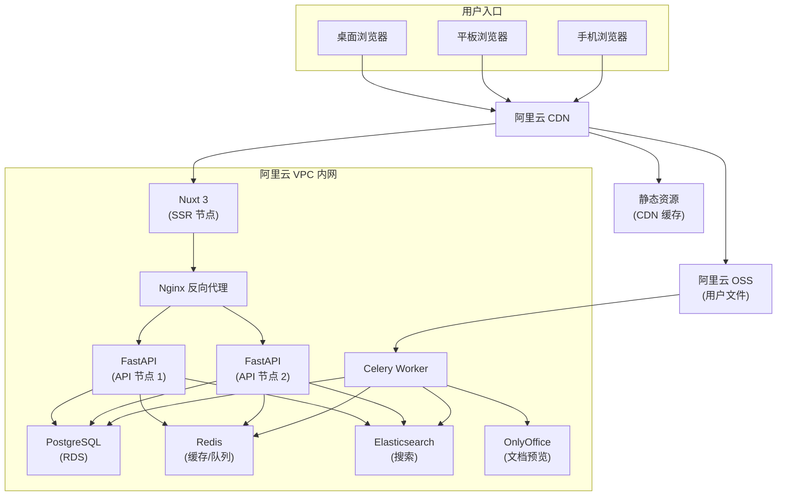

### 1.4 MVP 阶段云资源规划

| 资源 | 规格 | 月成本估算 |
|---|---|---|
| ECS (应用服务器) ×2 | 4C8G，用于 Nginx + Nuxt SSR + FastAPI | ¥600 |
| ECS (弹性扩容) | 按需，期末季临时增加 2-4 台 | ¥200-400 (均摊) |
| RDS PostgreSQL | 2C4G，50GB SSD | ¥400 |
| PgBouncer | ECS 应用服务器上部署，或 RDS 内置连接池 | ¥0 |
| Elasticsearch | 2C8G，单节点 | ¥500 |
| Redis | 1GB 标准版 | ¥150 |
| OSS 存储 | 按量付费（预估 100-200GB） | ¥50-100 |
| OSS 外网流量 | 月度约 300-800GB（经 CDN 回源） | ¥150-400 |
| CDN | 按量付费（月度 500GB-1TB 流量） | ¥150-300 |
| OnlyOffice | ECS 4C8G（与预览服务共用） | ¥300 |
| **合计** | | **约 ¥2,500-3,250/月** |

> 潮汐成本策略：大学类工具的流量呈显著"潮汐效应"——平时日活低迷，期末考前两周流量暴增 5-10 倍。建议在阿里云 SLB 后配置弹性伸缩组（Auto Scaling），按 CPU 利用率 > 70% 自动扩容、< 30% 自动缩容，考完试即缩容。同时 OSS 和 CDN 的流量费是云服务中最容易被忽视的"隐藏账单"——务必在下载 API 层设置每日下载限额（每人 50 次/天）、严格限制单文件大小上限，并最大化 CDN 缓存命中率来压降回源流量。


> 实际成本可随学生团队申请阿里云教育优惠或云厂商赞助而大幅降低。

---

## 2. 前端架构

### 2.1 整体方案

**Nuxt 3** (Vue 3 + TypeScript) + **Element Plus** + **Tailwind CSS**

#### 选型论证

Nuxt 3 相较 Next.js 的核心优势在于中文生态：Vue 在中国大学生中的渗透率远超 React，社区贡献者更易招聘；Element Plus 是当前 Vue 3 生态中维护最活跃的中文组件库。Nuxt 3 的混合渲染模式（`routeRules`）支持：

- **课程详情页**：SSR → 百度 SEO 可索引
- **首页信息流**：ISR（增量静态再生成），5 分钟过期 → 高并发承载
- **用户中心/上传页**：CSR → 强交互体验

### 2.2 目录结构

```
scustack-web/
├── app.vue                    # 根组件
├── nuxt.config.ts             # Nuxt 配置
├── tailwind.config.ts         # Tailwind 配置
├── assets/
│   ├── css/
│   └── fonts/
├── components/
│   ├── common/                # 通用组件
│   │   ├── AppHeader.vue
│   │   ├── AppFooter.vue
│   │   ├── FileIcon.vue
│   │   └── TrustBadge.vue     # 信任状态标签
│   ├── course/                # 课程相关
│   │   ├── CourseCard.vue
│   │   ├── CourseList.vue
│   │   ├── CourseFilter.vue   # 多维度筛选面板
│   │   └── CourseBreadcrumb.vue
│   ├── material/              # 资料相关
│   │   ├── MaterialCard.vue
│   │   ├── MaterialDetail.vue
│   │   ├── MaterialUploadForm.vue
│   │   ├── MaterialVersionHistory.vue
│   │   ├── FilePreview.vue    # 文件预览容器
│   │   └── RatingWidget.vue
│   ├── search/                # 搜索相关
│   │   ├── SearchBar.vue
│   │   ├── SearchResult.vue
│   │   └── SearchFilter.vue
│   └── user/                  # 用户相关
│       ├── LoginModal.vue
│       ├── UserProfile.vue
│       └── ContributionHistory.vue
├── composables/               # 组合式函数
│   ├── useAuth.ts
│   ├── useCoverImage.ts        # 封面图匹配
│   ├── useMaterial.ts          # 资料详情逻辑
│   ├── useSearch.ts            # 搜索逻辑（debounce、URL 同步、筛选、排序、补全）
│   └── useToast.ts             # Toast 通知
├── layouts/
│   ├── default.vue
│   ├── course.vue             # 课程页布局
│   └── admin.vue              # 管理后台布局
├── middleware/
│   ├── auth.ts
│   └── role.ts
├── pages/
│   ├── index.vue              # 首页（ISR）
│   ├── search.vue             # 搜索结果页
│   ├── course/
│   │   └── [id].vue           # 课程详情页（SSR）
│   ├── material/
│   │   └── [id].vue           # 资料详情页（SSR）
│   ├── upload.vue             # 上传页（CSR）
│   ├── user/
│   │   ├── profile.vue
│   │   └── contributions.vue
│   └── admin/
│       ├── review.vue         # 审核队列
│       └── courses.vue        # 课程管理
├── server/                    # Nuxt 服务端（API 代理层）
│   ├── api/
│   │   └── proxy/             # 转发至 FastAPI 的代理路由
│   └── middleware/
│       └── auth.ts            # 服务端鉴权中间件
├── stores/                    # Pinia 状态管理
│   ├── auth.ts
│   ├── course.ts
│   └── upload.ts
├── types/                     # TypeScript 类型定义
│   ├── course.ts
│   ├── material.ts
│   └── user.ts
└── utils/
    ├── api.ts                 # Axios/Fetch 封装
    ├── format.ts              # 格式化工具
    └── constants.ts           # 常量（分类、学期等）
```

### 2.3 路由设计

| 路由 | 渲染模式 | 说明 |
|---|---|---|
| `/` | ISR (5min) | 首页信息流 |
| `/search?q=&college=&category=&semester=&sort=` | SSR | 搜索结果页 |
| `/course/:id` | SSR | 课程详情页 |
| `/material/:id` | SSR | 资料详情页 |
| `/upload` | CSR (需登录) | 上传页面 |
| `/user/profile` | CSR (需登录) | 个人中心 |
| `/user/contributions` | CSR (需登录) | 我的贡献 |
| `/admin/*` | CSR (需维护者角色) | 管理后台 |

### 2.4 组件设计原则

- **高信息密度**：资料卡片同时展示标题、课程、学期、分类、格式、评分、大小、信任状态
- **响应式优先**：使用 Tailwind 断点 `sm/md/lg/xl`，卡片列表在不同视口下自适应列数
- **骨架屏加载**：数据加载中显示骨架屏，避免布局抖动
- **乐观更新**：评分、收藏等操作先更新 UI，后台同步，失败时回滚

### 2.5 性能目标

| 指标 | 目标值 |
|---|---|
| FCP (First Contentful Paint) | < 1.5s |
| LCP (Largest Contentful Paint) | < 2.5s |
| TTI (Time to Interactive) | < 3.0s |
| TBT (Total Blocking Time) | < 200ms |
| Lighthouse Performance | ≥ 90 |

---

## 3. 后端架构

### 3.1 整体方案

**Python 3.12 + FastAPI + SQLAlchemy 2.0 (async) + Celery**

#### 选型论证

FastAPI 是中小团队构建 REST API 时开发速度最快的框架：Pydantic 模型定义即文档、即校验；自动生成的 Swagger UI 让前后端联调无需额外沟通。Python 生态为未来的 AI 功能（课程推荐、标签自动提取、内容查重）提供最平滑的扩展路径。

### 3.2 目录结构

```
scustack-api/
├── alembic/                   # 数据库迁移
│   ├── versions/
│   └── env.py
├── app/
│   ├── __init__.py
│   ├── main.py                # FastAPI 应用入口
│   ├── config.py              # 配置管理（pydantic-settings）
│   ├── dependencies.py        # 依赖注入
│   ├── api/
│   │   ├── __init__.py
│   │   ├── v1/
│   │   │   ├── __init__.py
│   │   │   ├── router.py      # v1 路由聚合
│   │   │   ├── about.py       # 关于页面
│   │   │   ├── admin.py       # 管理接口 (analytics, blocklist, announcements, calendar, etc.)
│   │   │   ├── auth.py        # 认证接口
│   │   │   ├── bookmarks.py   # 收藏接口
│   │   │   ├── collections.py # 合集接口
│   │   │   ├── colleges.py    # 学院接口
│   │   │   ├── comments.py    # 评论接口
│   │   │   ├── copyright.py   # 版权投诉接口
│   │   │   ├── corrections.py # 纠错建议接口
│   │   │   ├── courses.py     # 课程接口
│   │   │   ├── feedback.py    # 用户反馈接口
│   │   │   ├── health.py      # 健康检查接口
│   │   │   ├── homepage.py    # 首页聚合接口
│   │   │   ├── materials.py   # 资料接口
│   │   │   ├── search.py      # 搜索接口
│   │   │   ├── upload.py      # 上传接口
│   │   │   ├── users.py       # 用户接口 (me/*)
│   │   │   └── wishes.py      # 心愿接口
│   ├── models/                # SQLAlchemy ORM 模型 (22 files)
│   │   ├── __init__.py
│   │   ├── account_deletion.py
│   │   ├── announcement.py
│   │   ├── audit_log.py
│   │   ├── bookmark.py
│   │   ├── calendar.py
│   │   ├── collection.py
│   │   ├── college.py
│   │   ├── comment.py
│   │   ├── content_blocklist.py
│   │   ├── copyright_complaint.py
│   │   ├── correction.py
│   │   ├── course.py
│   │   ├── feedback.py
│   │   ├── material.py
│   │   ├── notification.py
│   │   ├── rate_limit_log.py
│   │   ├── report.py
│   │   ├── review_log.py
│   │   ├── user.py
│   │   ├── user_badge.py
│   │   ├── user_consent.py
│   │   └── wish.py
│   ├── schemas/               # Pydantic 请求/响应模式
│   │   ├── __init__.py
│   │   ├── auth.py
│   │   ├── course.py
│   │   ├── material.py
│   │   ├── search.py
│   │   └── user.py
│   ├── services/              # 业务逻辑层 (22 files)
│   │   ├── __init__.py
│   │   ├── about_service.py
│   │   ├── announcement_service.py
│   │   ├── audit_service.py
│   │   ├── auth_service.py
│   │   ├── badge_service.py
│   │   ├── blocklist_service.py
│   │   ├── calendar_service.py
│   │   ├── collection_service.py
│   │   ├── college_service.py
│   │   ├── comment_service.py
│   │   ├── consent_service.py
│   │   ├── copyright_service.py
│   │   ├── course_service.py
│   │   ├── deletion_service.py
│   │   ├── homepage_service.py
│   │   ├── material_service.py
│   │   ├── report_service.py
│   │   ├── review_service.py
│   │   ├── search_service.py
│   │   ├── upload_service.py
│   │   ├── user_service.py
│   │   └── wish_service.py
│   ├── core/                  # 核心基础设施
│   │   ├── __init__.py
│   │   ├── security.py        # JWT、密码哈希、CSRF
│   │   ├── database.py        # 数据库连接池
│   │   ├── redis.py           # Redis 客户端
│   │   ├── elasticsearch.py   # ES 客户端
│   │   ├── oss.py             # 阿里云 OSS 客户端
│   │   └── celery.py          # Celery 配置
│   ├── middleware/
│   │   ├── __init__.py
│   │   ├── auth.py            # 认证中间件
│   │   ├── rate_limit.py      # 速率限制中间件
│   │   ├── cors.py            # CORS 中间件
│   │   └── audit.py           # 审计日志中间件
│   └── tasks/                 # Celery 异步任务
│       ├── __init__.py
│       ├── virus_scan.py
│       ├── thumbnail.py
│       ├── index_sync.py      # ES 索引同步
│       └── cleanup.py         # 过期文件清理
├── tests/
│   ├── conftest.py
│   ├── test_auth.py
│   ├── test_courses.py
│   ├── test_materials.py
│   ├── test_search.py
│   └── test_upload.py
├── pyproject.toml
├── Dockerfile
└── docker-compose.yml
```

### 3.3 分层架构

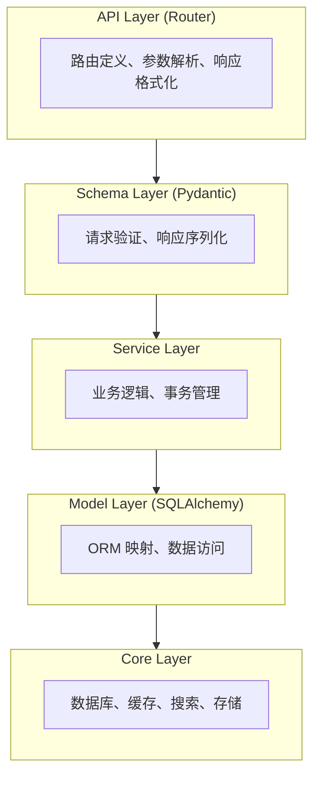

**严格分层规则**：
- Router 不直接调用 Model，必须通过 Service
- Service 不处理 HTTP 请求/响应对象，只接收纯数据参数
- Model 不包含业务逻辑，只定义数据结构

### 3.4 异步任务设计

| 任务 | 触发方式 | 优先级 | 预计耗时 |
|---|---|---|---|
| 文件病毒扫描 (ClamAV) | 上传完成后自动 | 高 | 5-30s |
| 内容安全预审 | 上传完成后自动 | 高 | 1-5s |
| 缩略图生成 | 上传完成后自动 | 中 | 1-10s |
| ES 搜索索引更新 | 资料状态变更 | 高 | < 1s |
| 全文内容提取 (OCR/文本) | 上传完成后自动 | 低 | 10-60s |
| 失效链接检测 | 定时任务（每日） | 低 | 视数量 |
| 过期数据清理 | 定时任务（每周） | 低 | 视数量 |

内容安全预审作为新增关键任务：当资料上传量攀升（如期末季日增 1000+ 份），纯靠维护者人工审核会导致审核队列快速积压崩溃。在 Celery 任务中增加自动化风控层：

- 文本审核：标题、描述调用阿里云内容安全 API（文本涉黄涉政检测），得分低于阈值直接自动通过
- 图片审核：上传的图片附件先经过阿里云内容安全 API（图片鉴黄涉政暴恐），干净内容自动放行
- 疑似违规兜底：API 返回 `review`（疑似）或 `block`（确认违规）的内容，自动标记 `doubtful` 或 `rejected`，仅将疑似案例推入人工审核队列
- 可选的 LLM 增强：后期可部署轻量级开源模型（如 Qwen2.5-0.5B）对文本元数据进行课程相关性判断——例如标题含"代写""刷课""广告"的直接拒绝

预计自动化过滤 70-85% 的常规上传，维护者仅需处理疑似违规和高风险内容。

---

## 4. 数据库设计

### 4.1 数据库选型：PostgreSQL 16

**相对于 MySQL 的不可替代优势**：

| 能力 | PostgreSQL 16 | MySQL 8.0 | 对本项目的影响 |
|---|---|---|---|
| 中文全文搜索 | zhparser/pg_jieba 精准分词 | ngram 二元分词 | **核心搜索能力** |
| 递归 CTE | `WITH RECURSIVE` 原生支持 | 需存储过程 | 学院→课程树形查询 |
| JSONB | GIN 索引，任意路径查询 | JSON 文本存储 | 灵活的资料元数据 |
| 时态表 | SQL:2011 标准 | 需触发器实现 | 版本历史审计追踪 |
| pgvector | IVFFlat/HNSW 索引，成熟稳定 | 起步阶段 | AI 推荐功能预留 |

### 4.2 核心数据模型

#### 用户 (users)

```sql
CREATE TABLE users (
    id          UUID PRIMARY KEY DEFAULT gen_random_uuid(),
    phone       VARCHAR(20) UNIQUE NOT NULL,  -- 手机号（AES-256 加密存储）
    nickname    VARCHAR(50) NOT NULL,
    avatar_url  VARCHAR(500),
    role        VARCHAR(20) NOT NULL DEFAULT 'student',  -- student | contributor | maintainer | admin
    wechat_openid VARCHAR(100) UNIQUE,        -- 微信登录绑定
    university_id VARCHAR(50),                -- 学号（可选，加密存储）
    trust_score INTEGER NOT NULL DEFAULT 0,    -- 用户信任分
    is_active   BOOLEAN NOT NULL DEFAULT TRUE,
    created_at  TIMESTAMPTZ NOT NULL DEFAULT now(),
    updated_at  TIMESTAMPTZ NOT NULL DEFAULT now()
);

-- 敏感字段使用 pgcrypto 加密
-- phone, university_id 在应用层 AES-256 加密后存储
```

#### 学院 (colleges)

```sql
CREATE TABLE colleges (
    id          UUID PRIMARY KEY DEFAULT gen_random_uuid(),
    name        VARCHAR(100) NOT NULL UNIQUE,
    slug        VARCHAR(100) NOT NULL UNIQUE,  -- URL 友好标识
    sort_order  INTEGER NOT NULL DEFAULT 0,
    created_at  TIMESTAMPTZ NOT NULL DEFAULT now()
);
```

#### 课程 (courses)

```sql
CREATE TABLE courses (
    id          UUID PRIMARY KEY DEFAULT gen_random_uuid(),
    college_id  UUID NOT NULL REFERENCES colleges(id),
    name        VARCHAR(200) NOT NULL,
    slug        VARCHAR(200) NOT NULL,
    aliases     JSONB NOT NULL DEFAULT '[]',   -- 课程别名/简称 ["高数", "高等数学A"]
    description TEXT,
    credit      NUMERIC(3,1),
    category    VARCHAR(50),                   -- 通识/专业必修/专业选修
    is_active   BOOLEAN NOT NULL DEFAULT TRUE,
    created_at  TIMESTAMPTZ NOT NULL DEFAULT now(),
    updated_at  TIMESTAMPTZ NOT NULL DEFAULT now(),
    UNIQUE(college_id, slug)
);

CREATE INDEX idx_courses_college ON courses(college_id);
CREATE INDEX idx_courses_name ON courses USING gin(to_tsvector('zhparser', name));
```

#### 资料 (materials)

```sql
CREATE TABLE materials (
    id              UUID PRIMARY KEY DEFAULT gen_random_uuid(),
    course_id       UUID NOT NULL REFERENCES courses(id),
    title           VARCHAR(500) NOT NULL,
    description     TEXT,
    category        VARCHAR(50) NOT NULL,       -- 课堂笔记|考试资料|作业|实验报告|代码|教材|复习提纲|其他
    semester        VARCHAR(20) NOT NULL,       -- 2024-2025-1
    teacher         VARCHAR(100),               -- 授课教师
    source_type     VARCHAR(20) NOT NULL,        -- hosted (托管文件) | external (外部链接)
    external_url    VARCHAR(2000),              -- source_type=external 时必填
    format          VARCHAR(20),                -- pdf|docx|pptx|zip|md|py|jpg|...
    file_size       BIGINT,                     -- 托管文件字节数
    file_hash       VARCHAR(64),                -- SHA-256（托管文件）
    trust_status    VARCHAR(20) NOT NULL DEFAULT 'unverified',  -- unverified|community_verified|maintainer_picked|doubtful
    review_status   VARCHAR(20) NOT NULL DEFAULT 'pending',    -- draft|pending|approved|rejected|removed
    average_rating  NUMERIC(3,2) DEFAULT 0,
    rating_count    INTEGER NOT NULL DEFAULT 0,
    download_count  INTEGER NOT NULL DEFAULT 0,
    is_pinned       BOOLEAN NOT NULL DEFAULT FALSE,
    contributor_id  UUID REFERENCES users(id),
    created_at      TIMESTAMPTZ NOT NULL DEFAULT now(),
    updated_at      TIMESTAMPTZ NOT NULL DEFAULT now()
);

CREATE INDEX idx_materials_course ON materials(course_id);
CREATE INDEX idx_materials_status ON materials(review_status, trust_status);
CREATE INDEX idx_materials_category ON materials(course_id, category);
CREATE INDEX idx_materials_semester ON materials(course_id, semester);
CREATE INDEX idx_materials_rating ON materials(course_id, average_rating DESC);
CREATE INDEX idx_materials_created ON materials(created_at DESC);
CREATE INDEX idx_materials_search ON materials
    USING gin(to_tsvector('zhparser', coalesce(title,'') || ' ' || coalesce(description,'')));
```

#### 资料版本 (material_versions)

```sql
CREATE TABLE material_versions (
    id              UUID PRIMARY KEY DEFAULT gen_random_uuid(),
    material_id     UUID NOT NULL REFERENCES materials(id) ON DELETE CASCADE,
    version_number  INTEGER NOT NULL,
    file_hash       VARCHAR(64) NOT NULL,        -- 此版本的 SHA-256
    storage_key     VARCHAR(500) NOT NULL,        -- OSS 存储路径
    file_size       BIGINT NOT NULL,
    change_note     TEXT,                         -- 更新说明
    uploaded_by     UUID REFERENCES users(id),
    created_at      TIMESTAMPTZ NOT NULL DEFAULT now(),
    UNIQUE(material_id, version_number)
);

CREATE INDEX idx_versions_material ON material_versions(material_id);
CREATE INDEX idx_versions_hash ON material_versions(file_hash);  -- 重复检测
```

#### 评分 (ratings)

```sql
CREATE TABLE ratings (
    id          UUID PRIMARY KEY DEFAULT gen_random_uuid(),
    material_id UUID NOT NULL REFERENCES materials(id) ON DELETE CASCADE,
    user_id     UUID NOT NULL REFERENCES users(id),
    score       SMALLINT NOT NULL CHECK (score BETWEEN 1 AND 5),
    created_at  TIMESTAMPTZ NOT NULL DEFAULT now(),
    UNIQUE(material_id, user_id)  -- 每人每资料仅可评分一次
);
```

#### 收藏/关注 (bookmarks)

```sql
CREATE TABLE bookmarks (
    id          UUID PRIMARY KEY DEFAULT gen_random_uuid(),
    user_id     UUID NOT NULL REFERENCES users(id),
    course_id   UUID REFERENCES courses(id),   -- 关注课程
    material_id UUID REFERENCES materials(id),  -- 收藏资料
    created_at  TIMESTAMPTZ NOT NULL DEFAULT now(),
    UNIQUE(user_id, course_id),
    UNIQUE(user_id, material_id),
    CHECK (course_id IS NOT NULL OR material_id IS NOT NULL)
);
```

#### 审核记录 (review_logs)

```sql
CREATE TABLE review_logs (
    id              UUID PRIMARY KEY DEFAULT gen_random_uuid(),
    material_id     UUID NOT NULL REFERENCES materials(id),
    reviewer_id     UUID NOT NULL REFERENCES users(id),
    action          VARCHAR(20) NOT NULL,       -- approved|rejected|returned|removed|flagged
    comment         TEXT,
    created_at      TIMESTAMPTZ NOT NULL DEFAULT now()
);
```

#### 举报 (reports)

```sql
CREATE TABLE reports (
    id              UUID PRIMARY KEY DEFAULT gen_random_uuid(),
    material_id     UUID NOT NULL REFERENCES materials(id),
    reporter_id     UUID NOT NULL REFERENCES users(id),
    reason          VARCHAR(50) NOT NULL,        -- copyright|outdated|inappropriate|duplicate|wrong_info|other
    description     TEXT,
    status          VARCHAR(20) NOT NULL DEFAULT 'pending',  -- pending|accepted|rejected
    handled_by      UUID REFERENCES users(id),
    handled_at      TIMESTAMPTZ,
    created_at      TIMESTAMPTZ NOT NULL DEFAULT now()
);
```

#### 校历 (academic_calendar)

```sql
CREATE TABLE academic_calendar (
    id          UUID PRIMARY KEY DEFAULT gen_random_uuid(),
    year        SMALLINT NOT NULL,              -- 2025
    semester    VARCHAR(20) NOT NULL,           -- 2025-2026-1
    event_name  VARCHAR(200) NOT NULL,           -- 期中考试周|期末考试周|选课周
    event_tag   VARCHAR(50) NOT NULL,            -- midterm|final|course_selection
    start_date  DATE NOT NULL,
    end_date    DATE NOT NULL,
    created_at  TIMESTAMPTZ NOT NULL DEFAULT now()
);
```

### 4.3 完整模型清单

实际代码中实现了 22 个模型文件（含 27 个 SQLAlchemy 模型类）：

| 文件 | 模型类 | 说明 |
|---|---|---|
| `user.py` | `User` | 用户基本信息与认证 |
| `college.py` | `College` | 学院信息 |
| `course.py` | `Course` | 课程信息与别名 |
| `material.py` | `Material`, `MaterialVersion` | 资料与版本管理 |
| `audit_log.py` | `AuditLog` | 审计日志 |
| `review_log.py` | `ReviewLog` | 审核记录 |
| `report.py` | `Report` | 举报记录 |
| `bookmark.py` | `Bookmark`, `CourseFollow` | 资料收藏与课程关注 |
| `notification.py` | `Notification` | 用户通知 |
| `calendar.py` | `CalendarEvent` | 校历事件 |
| `user_badge.py` | `UserBadge` | 用户徽章/成就 |
| `correction.py` | `CorrectionSuggestion` | 资料纠错建议 |
| `wish.py` | `Wish`, `WishVote`, `WishFulfillment` | 心愿与投票 |
| `copyright_complaint.py` | `CopyrightComplaint` | 版权投诉 |
| `comment.py` | `Comment` | 资料评论 |
| `collection.py` | `Collection`, `CollectionItem` | 资料合集 |
| `content_blocklist.py` | `ContentBlocklist` | 内容黑名单 |
| `announcement.py` | `Announcement` | 平台公告 |
| `rate_limit_log.py` | `RateLimitLog` | 速率限制日志 |
| `user_consent.py` | `UserConsent` | 用户同意记录 |
| `account_deletion.py` | `AccountDeletion` | 账号注销申请 |
| `feedback.py` | `Feedback` | 用户反馈 |

### 4.4 ER 关系图

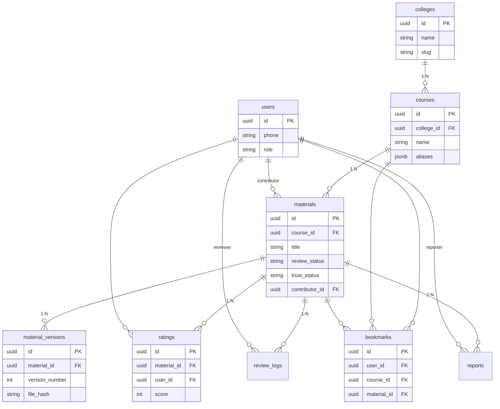

### 4.4 索引策略

| 表 | 索引类型 | 字段 | 用途 |
|---|---|---|---|
| materials | GIN (zhparser) | title, description | 数据库层辅助搜索（仅用于管理后台本地筛选） |
| materials | B-tree (复合) | (course_id, category) | 课程内分类筛选 |
| materials | B-tree (复合) | (course_id, average_rating DESC) | 课程内按评分排序 |
| materials | B-tree | review_status | 审核队列查询 |
| material_versions | B-tree | file_hash | 内容去重检测 |
| courses | GIN (zhparser) | name | 课程名称本地过滤（下拉搜索框联想） |
| courses | B-tree | (college_id) | 学院下课程列表 |

> **PG vs ES 搜索边界**：PostgreSQL GIN 索引仅用于课程名称的本地过滤（如上传页面的学院-课程二级联动下拉搜索框联想）。全平台搜索（首页搜索框、全局搜索、搜索结果页）统一走 Elasticsearch + IK 分词器。PG 的 zhparser 分词能力不足以支撑高质量的中英混合+专业术语搜索——详见第 5 节搜索引擎设计。
| ratings | B-tree | (material_id) | 评分聚合 |
| bookmarks | B-tree | (user_id, course_id) | 用户关注查询 |

---

## 5. 搜索引擎设计

### 5.1 为什么必须使用 Elasticsearch（而非 Meilisearch/Typesense）

课程资料搜索的核心难点在于**中文 + 英文 + 数字 + 专业术语的混合搜索**。真实用户搜索词如：

- "高等数学第七版 同济 课后答案"
- "数据结构 二叉树 实验报告"
- "BIM机电深化 课程设计"

实测数据：

| 搜索词类型 | Elasticsearch (IK) | Meilisearch | Typesense |
|---|---|---|---|
| 中文标准术语 | 精准 | 可接受 | 切为单字，召回率低 |
| 中英混合（含缩写） | 自定义词典后精准 | 不稳定 | 无法处理 |
| 专业术语 | 自定义词典后精准 | 无法优化 | 全单字切分 |
| P50延迟 | 8ms | 4ms | 2ms |
| 中文召回率 | > 95% | ~85% | ~60% |

**结论**：Typesense 的中文召回率仅 ~60%，根本不可用。Meilisearch 不支持自定义词典，专业术语错误无法修复。只有 Elasticsearch + IK 分词器 + 自定义词典能提供可优化的搜索质量。搜索是平台的核心竞争力，在这个组件上不可妥协。

### 5.2 索引设计

```json
// PUT /materials
{
  "settings": {
    "number_of_shards": 1,
    "number_of_replicas": 0,
    "analysis": {
      "analyzer": {
        "ik_smart_analyzer": {
          "type": "custom",
          "tokenizer": "ik_smart",
          "filter": ["lowercase"]
        },
        "ik_max_word_analyzer": {
          "type": "custom",
          "tokenizer": "ik_max_word",
          "filter": ["lowercase"]
        }
      }
    }
  },
  "mappings": {
    "properties": {
      "id": { "type": "keyword" },
      "title": {
        "type": "text",
        "analyzer": "ik_max_word_analyzer",
        "search_analyzer": "ik_smart_analyzer",
        "fields": {
          "raw": { "type": "keyword" }
        }
      },
      "description": {
        "type": "text",
        "analyzer": "ik_max_word_analyzer",
        "search_analyzer": "ik_smart_analyzer"
      },
      "content_text": {
        "type": "text",
        "analyzer": "ik_max_word_analyzer",
        "search_analyzer": "ik_smart_analyzer"
      },
      "college_name": { "type": "keyword" },
      "college_id": { "type": "keyword" },
      "course_name": {
        "type": "text",
        "analyzer": "ik_smart_analyzer",
        "fields": { "raw": { "type": "keyword" } }
      },
      "course_id": { "type": "keyword" },
      "course_aliases": { "type": "keyword" },
      "category": { "type": "keyword" },
      "semester": { "type": "keyword" },
      "format": { "type": "keyword" },
      "source_type": { "type": "keyword" },
      "teacher": { "type": "keyword" },
      "trust_status": { "type": "keyword" },
      "average_rating": { "type": "half_float" },
      "download_count": { "type": "integer" },
      "created_at": { "type": "date" },
      "review_status": { "type": "keyword" }
    }
  }
}
```

### 5.3 自定义词典策略

IK 分词器支持 `ext_dict` 热加载自定义词典，包含：

1. **四川大学专属词库**：学院名、专业名、课程名（如"高分子材料与工程"、"水力学"、"华西临床医学"）
2. **教材与术语**：常见教材全称/简称（如"同济七版"、"毛概"、"马原"、"大物"）
3. **课程别名映射**：将用户常用简称映射到标准课程名

词典文件维护于 `config/elasticsearch/custom_dict.dic`，通过 IK 热加载实现不停机更新。

---

## 6. 文件存储与预览

### 6.1 存储架构：阿里云 OSS + 直传

**核心原则：用户上传的文件永不经过应用服务器**

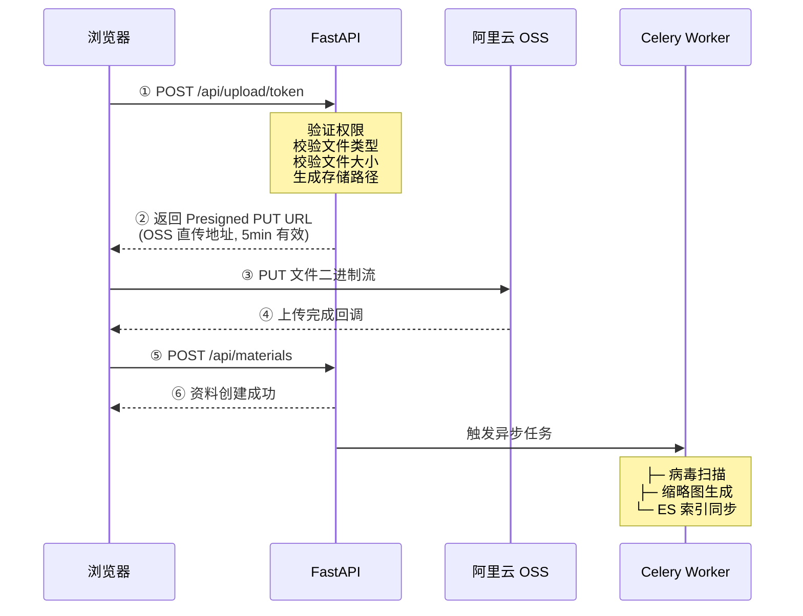

### 6.2 文件安全校验管道

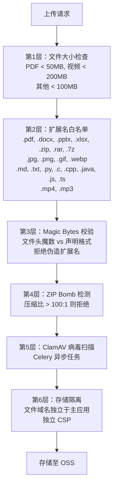

**Magic Bytes 校验表**：

| 声明格式 | 期望文件头 |
|---|---|
| PDF | `%PDF` |
| DOCX/PPTX/XLSX | `PK\x03\x04` (ZIP) |
| PNG | `\x89PNG\r\n\x1a\n` |
| JPEG | `\xFF\xD8\xFF` |
| ZIP/RAR | `PK\x03\x04` / `Rar!\x1a\x07` |

### 6.3 文档预览方案

采用分层预览策略，所有预览页面强制叠加**动态盲水印**：

| 格式 | 预览方案 | 水印方式 | 说明 |
|---|---|---|---|
| **PDF** | PDF.js（纯前端） | Canvas 叠加层渲染 | 零后端开销，支持中文 |
| **DOCX/PPTX/XLSX** | OnlyOffice 文档服务器（自托管） | OnlyOffice 自定义水印 API | 完整 Office 保真度，开源社区版免费 |
| **图片** | 原生 `` + 阿里云图片处理 | OSS 图片水印参数 | OSS 自动缩放、水印、格式转换 |
| **Markdown/代码** | Shiki 语法高亮 + remark/rehype 渲染 | CSS 伪元素水印层 | VS Code 级高亮质量，WASM 高性能 |
| **纯文本** | 前端直接渲染 `<pre>` | CSS 伪元素水印层 | 限制展示行数，大文件截断 |
| **压缩包** | 展示文件列表（名称、大小） | — | 不解压内容 |
| **视频/音频** | HTML5 `<video>`/`<audio>` | — | 使用 OSS CDN 加速 |

动态盲水印策略（版权溯源关键措施）：

- 水印内容：当前登录用户的 `UUID` 后 8 位 + 时间戳（如 `a1b2c3d4 · 2026-06-14`）
- 水印样式：半透明（opacity 0.06-0.10），平铺覆盖整个预览区域，不影响阅读但截图可追溯
- 实现方式：PDF/Office 预览在 Canvas 上叠加渲染水印层；图片使用 OSS 的 `watermark` 参数动态嵌入；文本类通过 CSS `::after` 伪元素平铺
- 设计意图：当面临校方或出版社的版权施压时，水印机制能证明平台具有内容溯源能力，降低法律风险，同时威慑恶意传播行为（截图可追溯到人）

OnlyOffice 中文字体配置：

```bash
# 安装开源中文字体
docker cp NotoSansCJKsc-Regular.otf onlyoffice:/usr/share/fonts/truetype/custom/
docker cp LXGWWenKai-Regular.ttf onlyoffice:/usr/share/fonts/truetype/custom/
docker exec onlyoffice chmod 646 /usr/share/fonts/truetype/custom/*
docker exec onlyoffice fc-cache -fv
docker exec onlyoffice /usr/bin/documentserver-generate-allfonts.sh
docker exec onlyoffice supervisorctl restart all
```

推荐字体：Noto Sans CJK SC（思源黑体）、LXGW WenKai（霞鹜文楷），均为开源可商用。

### 6.4 缩略图生成

| 文件类型 | 生成方式 | 说明 |
|---|---|---|
| PDF | PyMuPDF (fitz) | ~50ms/页，内存 < 20MB，远优于无头浏览器 |
| Office | LibreOffice headless 转 PDF → PyMuPDF 截取首页 | 需配置中文字体映射 |
| 图片 | Pillow / Sharp | 缩放至 256px 宽，WebP 格式 |
| 代码/MD | Shiki 渲染 → Puppeteer 截图 | 仅在需要卡片预览时生成 |

### 6.5 下载流程

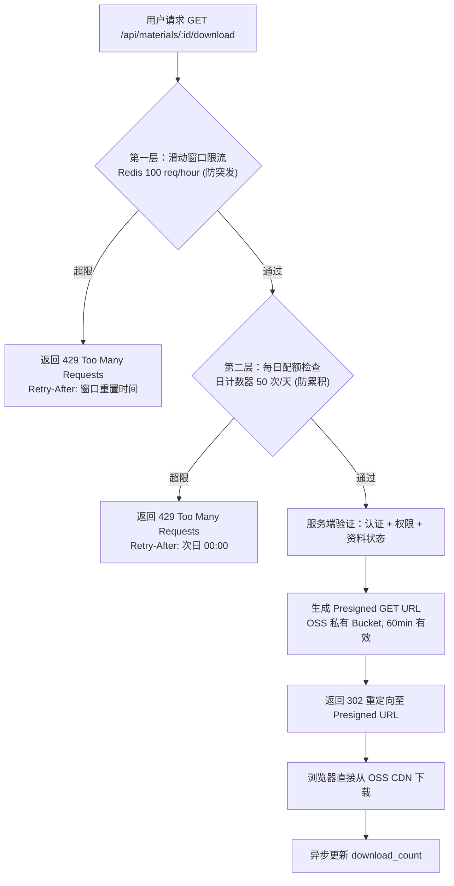

防刷与流量保护：

下载接口实施**双层限流**，任一层触发均返回 429：

| 层级 | 机制 | 阈值 | 用途 |
|---|---|---|---|
| **第一层（防突发）** | Redis 滑动窗口计数器 | 100 req/hour（学生）、150 req/hour（贡献者）、无限制（维护者+） | 防止单用户短时间内高频下载刷走 OSS 流量 |
| **第二层（防累积）** | Redis 日计数器（每日 00:00 重置） | 50 次/天（学生）、100 次/天（贡献者）、无限制（维护者+） | 防止恶意爬虫跨小时持续下载 |

- 两层共享同一 Redis key 前缀 `rate_limit:download:{user_id}`，独立计数、独立 TTL
- 单文件大小上限：PDF/Office < 50MB，视频 < 200MB，压缩包 < 100MB。拒绝超大文件上传
- CDN 缓存最大化：OSS Presigned URL 配合 CDN 加速，回源率控制在 10% 以下，大幅降低 OSS 外网流量费（这是云账单中最容易被忽视的隐藏开销）
- 异常监控：监控单用户下载量突增（如 1 小时内 > 200 次），自动触发临时封禁 + 告警通知

---

## 7. 版本管理

### 7.1 双轨版本策略

根据 PRD 决策，平台采用双轨版本管理：

**文本/代码类资料**（.md, .txt, .py, .js 等）：
- 类 Git 的历史追踪与差异展示
- 使用 `diff-match-patch` 库生成语义差异
- 存储完整快照 + 计算补丁用于展示
- 支持版本间逐行差异对比视图

**二进制文档类资料**（.pdf, .docx, .pptx, .zip 等）：
- 版本号 + 元数据管理
- 每个版本存储完整文件快照
- 元数据包含：版本号、SHA-256、更新说明、贡献者、上传时间
- 一个版本为"当前推荐版本"，旧版本在具备追溯价值时保持可见

### 7.2 内容去重

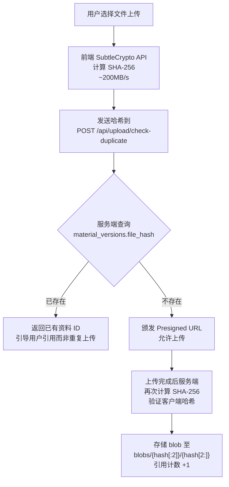

**预期效果**：课程资料场景下（多位学生上传相同讲义），预计去重节省 50-70% 存储空间。

### 7.3 垃圾回收

后台定时任务（每周）：
1. 扫描 `material_versions` 表，构建所有活跃的 `file_hash` 集合
2. 扫描 OSS blobs 目录，列出所有存储的 blob
3. 删除不在活跃集合中的 blob（保留 30 天宽限期）
4. 记录清理日志

---

## 8. 认证与授权

### 8.1 认证方案

**分层认证体系**：

| 层级 | 方式 | 用途 |
|---|---|---|
| **Tier 1 (必选)** | 手机号 + 短信验证码 | 主注册/登录方式。手机号在中国已实名制，天然满足实名制要求 |
| **Tier 2 (可选)** | 微信 OAuth 2.0 | 免密登录。微信在中国大学生中覆盖率 100% |
| **Tier 3 (预留)** | 大学 SSO (CAS/OAuth2) | 未来对接川大统一认证系统 |

### 8.2 Token 设计

采用 **JWT (Access Token + Refresh Token)** 双令牌机制，存储于 httpOnly Cookie：

| 令牌 | 有效期 | 存储位置 | 说明 |
|---|---|---|---|
| Access Token | 15 分钟 | httpOnly, Secure, SameSite=Lax Cookie | 每次 API 请求自动携带 |
| Refresh Token | 7 天 | httpOnly, Secure, SameSite=Strict Cookie + 数据库 | 服务端可撤销 |

**Refresh Token 轮换机制**：
- 每次使用 Refresh Token 刷新时，签发新的 Refresh Token，旧的立即失效
- 检测到已失效的 Refresh Token 被使用时，视为令牌泄露，撤销该用户所有 Refresh Token
- Refresh Token 存储于 `refresh_tokens` 表，支持按用户批量撤销

### 8.3 JWT Payload

```json
{
  "sub": "user-uuid",
  "role": "student",
  "trust_score": 0,
  "iat": 1700000000,
  "exp": 1700000900,
  "jti": "unique-token-id"
}
```

### 8.4 角色与权限矩阵

| 权限 | 访问者 | 学生 | 贡献者 | 维护者 | 管理员 |
|---|---|---|---|---|---|
| 浏览/搜索资料 | ✓ | ✓ | ✓ | ✓ | ✓ |
| 查看资料详情 | ✓ | ✓ | ✓ | ✓ | ✓ |
| 下载资料 | | ✓ | ✓ | ✓ | ✓ |
| 上传资料 (限速) | | ✓ | ✓ | ✓ | ✓ |
| 上传资料 (高配额) | | | ✓ | ✓ | ✓ |
| 编辑/删除自己的资料 | | ✓ | ✓ | ✓ | ✓ |
| 评分 | | ✓ | ✓ | ✓ | ✓ |
| 举报 | | ✓ | ✓ | ✓ | ✓ |
| 审核资料 | | | | ✓ | ✓ |
| 管理课程目录 | | | | ✓ | ✓ |
| 置顶/推荐资料 | | | | ✓ | ✓ |
| 处理举报 | | | | ✓ | ✓ |
| 管理用户权限 | | | | | ✓ |
| 查看审计日志 | | | | | ✓ |

### 8.5 权限实现

使用基于能力的权限模型（Capability-based RBAC）：

```python
# app/core/permissions.py

class Permission(enum.StrEnum):
    MATERIALS_READ = "materials:read"
    MATERIALS_CREATE = "materials:create"
    MATERIALS_DELETE_OWN = "materials:delete:own"
    MATERIALS_DELETE_ANY = "materials:delete:any"
    MATERIALS_MODERATE = "materials:moderate"
    MATERIALS_PIN = "materials:pin"
    USERS_MANAGE = "users:manage"
    AUDIT_READ = "audit:read"

ROLE_PERMISSIONS = {
    "visitor":    {Permission.MATERIALS_READ},
    "student":    {Permission.MATERIALS_READ, Permission.MATERIALS_CREATE,
                   Permission.MATERIALS_DELETE_OWN},
    "contributor": {Permission.MATERIALS_READ, Permission.MATERIALS_CREATE,
                    Permission.MATERIALS_DELETE_OWN},  # 额外享受高上传配额
    "maintainer": {Permission.MATERIALS_READ, Permission.MATERIALS_CREATE,
                   Permission.MATERIALS_DELETE_ANY, Permission.MATERIALS_MODERATE,
                   Permission.MATERIALS_PIN, Permission.AUDIT_READ},
    "admin":      {*Permission},  # 所有权限
}
```

中间件模式：

```python
# app/dependencies.py
from fastapi import Depends, HTTPException

def require_permission(*permissions: Permission):
    async def checker(current_user = Depends(get_current_user)):
        user_perms = ROLE_PERMISSIONS.get(current_user.role, set())
        if not set(permissions).issubset(user_perms):
            raise HTTPException(status_code=403, detail="Forbidden")
        return current_user
    return checker

# 使用
@router.post("/materials/{id}/pin")
async def pin_material(
    id: UUID,
    user = Depends(require_permission(Permission.MATERIALS_PIN))
):
    ...
```

---

## 9. 安全设计

### 9.1 传输层安全

- 全站 HTTPS，HSTS 头 `max-age=31536000; includeSubDomains`
- TLS 1.2+ 最低版本，禁用弱加密套件
- CDN → 源站间使用阿里云内网传输

### 9.2 CSRF 防护（三层）

| 层 | 措施 | 说明 |
|---|---|---|
| 1 | `SameSite=Lax` Cookie | 阻止第三方 POST 表单携带 Cookie |
| 2 | 自定义请求头 `X-Requested-With: XMLHttpRequest` | 触发 CORS 预检，攻击者无法跨域设置 |
| 3 | 双重提交 Cookie 模式 | 非 httpOnly Cookie 中的 CSRF Token 需与请求头一致 |

### 9.3 XSS 防护

| 措施 | 实现 |
|---|---|
| Vue 自动转义 | 默认防御。严禁使用 `v-html` 除非经 DOMPurify 消毒 |
| Content-Security-Policy | `default-src 'self'; script-src 'self'; object-src 'none'; base-uri 'self'` |
| 服务端输入消毒 | 所有文本元数据（标题、描述）在存储前 strip HTML 标签 |
| 文件域名隔离 | 用户上传文件服务于独立域名（`files.scustack.cn`），独立 CSP，即使 PDF 内嵌恶意脚本也无法访问主应用 Cookie |

### 9.4 文件上传安全

详见第 6.2 节的六层校验管道。

### 9.5 速率限制

| 端点 | 限制 | 维度 |
|---|---|---|
| `GET /api/*` (读) | 60 req/min | 每用户 |
| `POST /api/auth/sms/send` | 3 req / 10min | 每手机号 + 每 IP |
| `POST /api/auth/login` | 5 req/min | 每 IP |
| `POST /api/materials` (上传) | 10 req/hour | 每用户 |
| `GET /api/materials/:id/download` | 100 req/hour + 50 次/天（双层） | 每用户 |
| `POST /api/reports` (举报) | 20 req/day | 每用户 |

> **下载双层限流**：下载接口应用两层独立限流——① Redis 滑动窗口 100 req/hour（防突发高频刷量）② 每日配额计数器 50 次/天（防累积爬虫）。任一层触发均返回 HTTP 429 + `Retry-After` 头。两层使用独立 Redis key 和独立 TTL。详见 §6.5 下载流程。

实现：Redis 滑动窗口 + 返回 HTTP 429 + `Retry-After` 头。

### 9.6 审核与信任体系

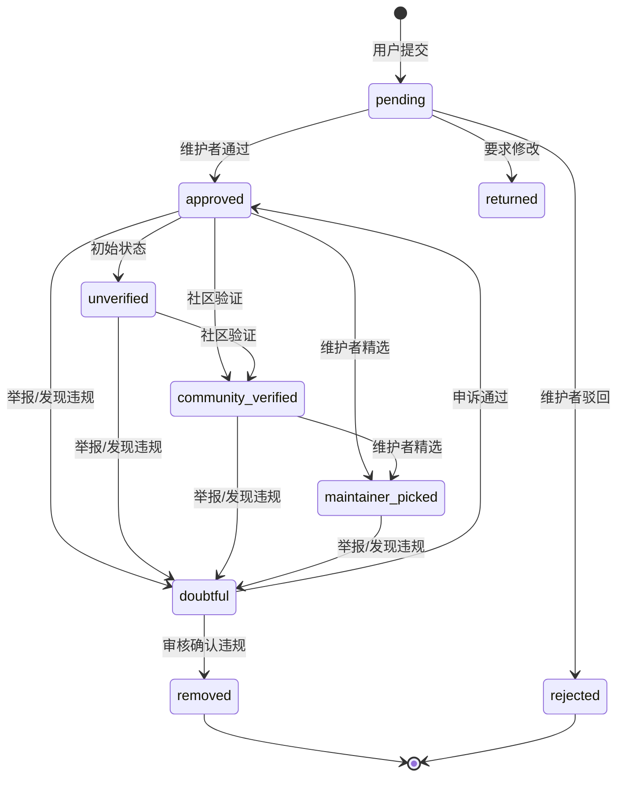

### 9.7 审计日志

所有敏感操作写入审计日志：

```sql
CREATE TABLE audit_logs (
    id          UUID PRIMARY KEY DEFAULT gen_random_uuid(),
    user_id     UUID REFERENCES users(id),
    action      VARCHAR(100) NOT NULL,    -- material.upload, material.approve, user.ban, etc.
    resource    VARCHAR(100),             -- material:uuid, course:uuid
    detail      JSONB,                    -- 操作详情
    ip_address  INET,
    user_agent  TEXT,
    created_at  TIMESTAMPTZ NOT NULL DEFAULT now()
);
```

---

## 10. 性能优化

### 10.1 缓存策略

| 场景 | 缓存方式 | TTL | 说明 |
|---|---|---|---|
| 课程详情页 | Nuxt ISR + CDN | 5min | 页面级缓存 |
| 学院/课程列表 | Redis | 30min | 变更频率低 |
| 热门搜索词 | Redis | 1 hour | 搜索建议 |
| 用户会话 | Redis | 15min (Access Token) | JWT 无状态为主 |
| 速率限制计数 | Redis 滑动窗口 | 按窗口 | |
| 资料下载计数 | Redis 计数器 → DB 定时回写 | 5min 回写 | 高并发写缓冲 |
| 文件缩略图 | OSS + CDN | 7 days | 内容哈希为 Key，永不失效 |
| 静态资源 | CDN | 30 days (带哈希文件名) | |

### 10.2 数据库优化

- 连接池管理（关键）：FastAPI 使用 Uvicorn 多 Worker 模式时，总连接数 = Worker 数 × 每 Worker 连接池大小。2 台 ECS × 每台 4 Worker × 20 连接 = 160 个连接，已接近 2C4G RDS 的默认 `max_connections` 上限（~200）。必须引入 PgBouncer（事务池模式）部署在应用侧或 RDS 侧，将应用层的 160 个连接收敛为 20-30 个实际数据库连接。PgBouncer 配置：`pool_mode = transaction`，`default_pool_size = 25`，`max_client_conn = 500`。若不引入 PgBouncer，期末季弹性扩容新增 ECS 实例时，连接数将直接压垮数据库。
- 读写分离：MVP 阶段暂不需要，预留 `SQLALCHEMY_READ_URL` 配置
- 查询优化：
  - 所有列表查询使用分页（cursor-based pagination for infinite scroll）
  - N+1 问题：使用 `selectinload` / `joinedload` 预加载关联
  - 计数类查询使用 Redis 缓存而非实时 `COUNT(*)`
- 慢查询监控：PostgreSQL `pg_stat_statements` + `auto_explain`

### 10.3 前端性能

- Nuxt 3 组件级代码分割（自动）
- 图片懒加载 (`loading="lazy"`)
- 关键 CSS 内联（Nuxt 自动）
- 字体子集化（仅加载用到的中文字符）
- 路由预取 (`<NuxtLink prefetch>`)
- OnlyOffice 预览按需加载（用户点击"预览"时才加载 iframe）

### 10.4 并发模型与潮汐扩容

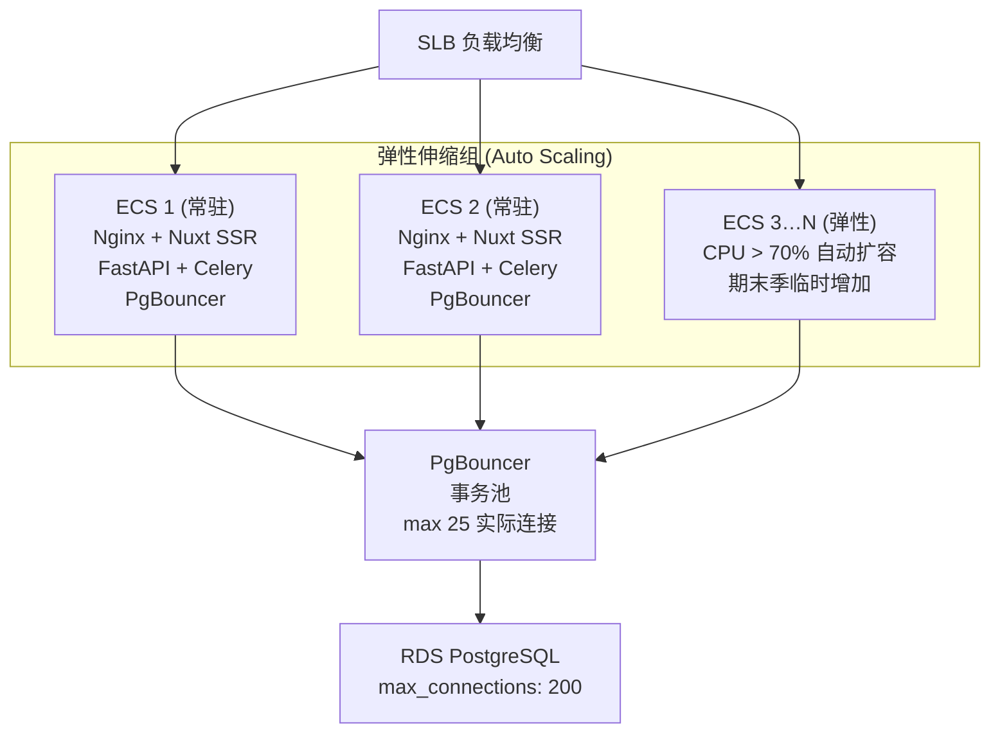

大学工具类产品具有极显著的流量"潮汐效应"——平时日活用户寥寥，期末考前两周流量暴增 5-10 倍，考完即断崖回落。Nuxt 的 SSR 渲染在并发高峰是 CPU 消耗大户。

| 阶段 | ECS 数量 | 触发条件 | 预计承载 |
|---|---|---|---|
| 平时 | 2 台常驻 | — | ~4,000 并发 |
| 期中/期末考前 | 4-6 台 | CPU > 70% 持续 5 分钟 | ~8,000-12,000 并发 |
| 选课周 | 3-4 台 | 定时扩容（校历驱动） | ~6,000-8,000 并发 |

- 扩容策略：阿里云 ESS (弹性伸缩) + 自定义镜像，新实例 3 分钟内就绪
- 缩容策略：CPU < 20% 持续 30 分钟后逐步缩容，最小保留 2 台常驻
- 预热机制：期末考前一周的凌晨定时增加至 3 台，避免高峰瞬间打垮服务
- PgBouncer 关键性：弹性扩容新增 ECS 实例时，所有实例共享 PgBouncer 的事务池，数据库实际连接数恒定在 ~25，不会随应用实例数线性增长

---

## 11. API 设计规范

### 11.1 URL 设计

```
# ── 学院 ─────────────────────────────────────────────────
GET    /api/v1/colleges                          # 学院列表
POST   /api/v1/colleges                          # 创建学院 (admin)
GET    /api/v1/colleges/:id                       # 学院详情
GET    /api/v1/colleges/:id/courses               # 学院下课程列表

# ── 课程 ─────────────────────────────────────────────────
GET    /api/v1/courses                            # 课程列表（支持筛选）
POST   /api/v1/courses                            # 创建课程 (maintainer+)
GET    /api/v1/courses/:id                        # 课程详情
PATCH  /api/v1/courses/:id                        # 更新课程 (maintainer+)
POST   /api/v1/courses/:id/merge                  # 合并课程别名 (maintainer+)
GET    /api/v1/courses/:id/materials              # 课程下资料列表

# ── 资料 ─────────────────────────────────────────────────
GET    /api/v1/materials                          # 资料列表
POST   /api/v1/materials                          # 创建资料
GET    /api/v1/materials/:id                      # 资料详情
PATCH  /api/v1/materials/:id                      # 更新资料
DELETE /api/v1/materials/:id                      # 删除资料 (own/admin)
GET    /api/v1/materials/:id/versions             # 版本历史
POST   /api/v1/materials/:id/versions             # 上传新版本
GET    /api/v1/materials/:id/versions/:vid/diff   # 版本差异 (文本)
GET    /api/v1/materials/:id/download             # 下载 (302 → Presigned URL)
POST   /api/v1/materials/:id/ratings              # 评分
GET    /api/v1/materials/:id/related              # 相关推荐（同课程热门资料）
POST   /api/v1/materials/:id/reports              # 举报
POST   /api/v1/materials/:id/corrections          # 纠错建议

# ── 评论 ─────────────────────────────────────────────────
GET    /api/v1/materials/:id/comments             # 资料评论列表
POST   /api/v1/materials/:id/comments             # 发表评论
DELETE /api/v1/materials/:id/comments/:cid        # 删除评论 (own/admin)

# ── 收藏 ─────────────────────────────────────────────────
GET    /api/v1/bookmarks                          # 我的收藏列表
POST   /api/v1/bookmarks                          # 添加收藏
DELETE /api/v1/bookmarks/:id                      # 取消收藏

# ── 合集 ─────────────────────────────────────────────────
GET    /api/v1/collections                        # 我的合集列表
POST   /api/v1/collections                        # 创建合集
GET    /api/v1/collections/:id                    # 合集详情
PATCH  /api/v1/collections/:id                    # 更新合集
DELETE /api/v1/collections/:id                    # 删除合集
POST   /api/v1/collections/:id/items              # 添加资料到合集
DELETE /api/v1/collections/:id/items/:item_id     # 从合集中移除资料

# ── 心愿 ─────────────────────────────────────────────────
GET    /api/v1/wishes                             # 心愿列表
POST   /api/v1/wishes                             # 创建心愿
GET    /api/v1/wishes/:id                         # 心愿详情
POST   /api/v1/wishes/:id/vote                    # 投票
POST   /api/v1/wishes/:id/fulfill                 # 满足心愿（上传资料关联）

# ── 版权投诉 ─────────────────────────────────────────────
POST   /api/v1/copyright/complaint                # 提交版权投诉
GET    /api/v1/copyright/complaint/:id            # 投诉状态查询

# ── 首页 ─────────────────────────────────────────────────
GET    /api/v1/homepage                           # 首页聚合数据（Stats + 热门资料 + 公告）

# ── 关于 ─────────────────────────────────────────────────
GET    /api/v1/about                              # 关于页面数据

# ── 反馈 ─────────────────────────────────────────────────
POST   /api/v1/feedback                           # 提交用户反馈

# ── 健康检查 ─────────────────────────────────────────────
GET    /api/v1/health                             # 健康检查（含 DB/Redis/ES/OSS/ClamAV）
GET    /api/v1/health/live                        # 存活探针
GET    /api/v1/health/ready                       # 就绪探针

# ── 搜索 ─────────────────────────────────────────────────
GET    /api/v1/search                             # 搜索
GET    /api/v1/search/suggest                     # 搜索建议/自动补全
GET    /api/v1/search/hot                         # 热门搜索词

# ── 上传 ─────────────────────────────────────────────────
POST   /api/v1/upload/token                       # 获取上传凭证
POST   /api/v1/upload/check-duplicate             # 检查内容重复

# ── 认证 ─────────────────────────────────────────────────
POST   /api/v1/auth/sms/send                      # 发送短信验证码
POST   /api/v1/auth/sms/verify                    # 验证码登录
POST   /api/v1/auth/wechat/url                    # 获取微信授权链接
POST   /api/v1/auth/wechat/callback               # 微信登录回调
POST   /api/v1/auth/refresh                       # 刷新 Token
POST   /api/v1/auth/logout                        # 登出

# ── 个人中心 (/me) ───────────────────────────────────────
GET    /api/v1/me                                 # 个人资料
PATCH  /api/v1/me                                 # 更新个人资料
GET    /api/v1/me/contributions                   # 我的贡献
GET    /api/v1/me/notifications                   # 我的通知
GET    /api/v1/me/privacy                         # 隐私设置
PATCH  /api/v1/me/privacy                         # 更新隐私设置
GET    /api/v1/me/badges                          # 我的徽章
POST   /api/v1/me/recovery-codes                  # 生成恢复码
POST   /api/v1/me/recovery-codes/verify           # 验证恢复码
PATCH  /api/v1/me/email                           # 绑定邮箱
POST   /api/v1/me/deactivate                      # 注销账号
POST   /api/v1/me/delete-account                  # 申请注销账号
POST   /api/v1/me/cancel-deletion                 # 取消注销
GET    /api/v1/me/deletion-status                 # 注销状态

# ── 管理后台 ─────────────────────────────────────────────
GET    /api/v1/admin/review-queue                 # 审核队列 (maintainer+)
POST   /api/v1/admin/review/:material_id          # 审核操作 (maintainer+)
POST   /api/v1/admin/review/batch                 # 批量审核 (maintainer+)
GET    /api/v1/admin/reports                      # 举报队列 (maintainer+)
POST   /api/v1/admin/reports/:id/handle           # 处理举报 (maintainer+)
GET    /api/v1/admin/audit-logs                   # 审计日志 (admin)
GET    /api/v1/admin/users                        # 用户列表 (admin)
GET    /api/v1/admin/users/:id                    # 用户详情 (admin)
PATCH  /api/v1/admin/users/:id                    # 更新用户 (admin)
GET    /api/v1/admin/materials                    # 资料管理列表 (maintainer+)
PATCH  /api/v1/admin/materials/:id/trust          # 设置信任状态 (maintainer+)
POST   /api/v1/admin/materials/:id/check-link     # 手动链接检查 (maintainer+)
GET    /api/v1/admin/analytics                    # 分析概览 (maintainer+)
GET    /api/v1/admin/analytics/trends             # 趋势分析 (maintainer+)
GET    /api/v1/admin/analytics/upload-stats       # 上传统计 (maintainer+)
GET    /api/v1/admin/analytics/search-stats       # 搜索统计 (maintainer+)
GET    /api/v1/admin/dead-links                   # 失效链接列表 (maintainer+)
GET    /api/v1/admin/duplicates                   # 重复资料检测 (maintainer+)
GET    /api/v1/admin/storage/stats                # 存储统计 (maintainer+)
GET    /api/v1/admin/security/logs                # 安全日志 (maintainer+)
GET    /api/v1/admin/blocklist                    # 黑名单列表 (maintainer+)
POST   /api/v1/admin/blocklist                    # 添加黑名单 (maintainer+)
PATCH  /api/v1/admin/blocklist/:id                # 更新黑名单 (maintainer+)
DELETE /api/v1/admin/blocklist/:id                # 删除黑名单 (maintainer+)
GET    /api/v1/admin/announcements                # 公告列表 (maintainer+)
POST   /api/v1/admin/announcements                # 创建公告 (maintainer+)
PATCH  /api/v1/admin/announcements/:id            # 更新公告 (maintainer+)
DELETE /api/v1/admin/announcements/:id            # 删除公告 (maintainer+)
GET    /api/v1/admin/calendar                     # 校历列表 (maintainer+)
POST   /api/v1/admin/calendar                     # 创建校历事件 (maintainer+)
PATCH  /api/v1/admin/calendar/:id                 # 更新校历事件 (maintainer+)
DELETE /api/v1/admin/calendar/:id                 # 删除校历事件 (maintainer+)
```

### 11.2 响应格式

**成功响应**：

```json
{
  "code": 0,
  "data": { ... },
  "message": "ok"
}
```

**列表响应**：

```json
{
  "code": 0,
  "data": {
    "items": [ ... ],
    "total": 150,
    "page": 1,
    "page_size": 20,
    "next_cursor": "eyJpZCI6ICJ4eHgiLCAiY3JlYXRlZF9hdCI6ICIyMDI0LTAxLTAxIn0="
  }
}
```

**错误响应**：

```json
{
  "code": 40001,
  "data": null,
  "message": "资料标题不能为空",
  "detail": [
    {
      "field": "title",
      "reason": "required"
    }
  ]
}
```

### 11.3 搜索 API

```
GET /api/v1/search?q=高等数学&college=计算机学院&category=考试资料&semester=2024-2025-1&sort=rating&page=1&page_size=20
```

请求参数：

| 参数 | 类型 | 必填 | 说明 |
|---|---|---|---|
| `q` | string | 否 | 搜索关键词（为空时返回全部，按排序规则排列） |
| `college` | string | 否 | 学院 slug 筛选 |
| `course_id` | UUID | 否 | 课程 ID 精确筛选 |
| `category` | string | 否 | 资料分类筛选 |
| `semester` | string | 否 | 学期筛选 |
| `source_type` | string | 否 | hosted / external |
| `format` | string | 否 | 文件格式筛选 |
| `sort` | string | 否 | relevance(默认) / rating / downloads / newest |
| `page` | int | 否 | 页码，默认 1 |
| `page_size` | int | 否 | 每页数量，默认 20，最大 50 |

排序权重（Elasticsearch function_score）：
- 基础分：BM25 文本相关性
- 加权因子：`trust_status` (maintainer_picked > community_verified > unverified > doubtful)
- 加权因子：`average_rating` (对数归一化)
- 加权因子：`download_count` (对数归一化)
- 衰减因子：`created_at` (按资料新鲜度衰减，newest 排序时权重更高)

---

## 12. 部署与运维

### 12.1 部署架构

全部部署于**阿里云**（中国大陆 Region），VPC 内网通信。

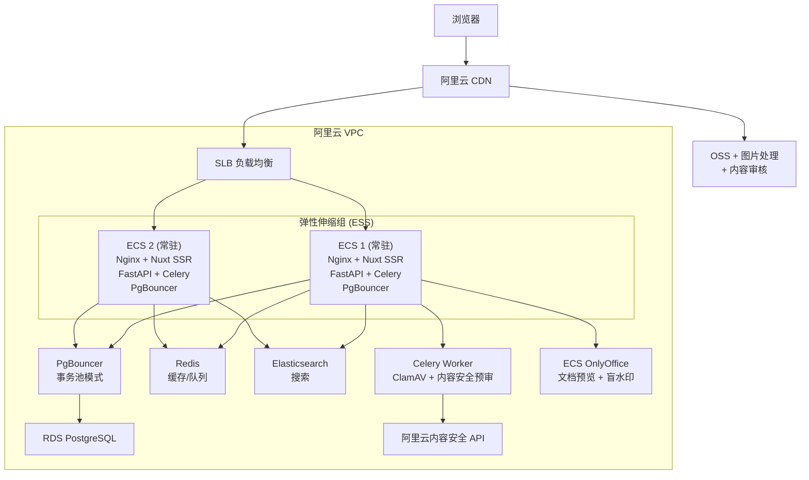

弹性伸缩配置：

| 参数 | 值 |
|---|---|
| 最小实例数 | 2 |
| 最大实例数 | 8 |
| 扩容触发 | CPU > 70% 持续 5 分钟 |
| 缩容触发 | CPU < 20% 持续 30 分钟 |
| 预热实例 | 期末考前一周 3 台 |
| 实例启动时间 | < 3 分钟（自定义镜像） |

### 12.2 Docker Compose (开发环境)

```yaml
# docker-compose.yml (开发环境)
services:
  postgres:
    image: postgres:16-alpine
    environment:
      POSTGRES_DB: scustack
      POSTGRES_USER: scustack
      POSTGRES_PASSWORD: ${DB_PASSWORD}
    volumes:
      - pgdata:/var/lib/postgresql/data
      - ./docker/postgres/init.sql:/docker-entrypoint-initdb.d/init.sql
    ports:
      - "5432:5432"

  redis:
    image: redis:7-alpine
    ports:
      - "6379:6379"

  elasticsearch:
    image: elasticsearch:8.12.0
    environment:
      - discovery.type=single-node
      - xpack.security.enabled=false
      - "ES_JAVA_OPTS=-Xms512m -Xmx512m"
    volumes:
      - esdata:/usr/share/elasticsearch/data
      - ./docker/es/ik:/usr/share/elasticsearch/plugins/ik
    ports:
      - "9200:9200"

  onlyoffice:
    image: onlyoffice/documentserver:latest
    environment:
      - JWT_ENABLED=false
    volumes:
      - oodata:/var/log/onlyoffice
      - ./docker/onlyoffice/fonts:/usr/share/fonts/truetype/custom
    ports:
      - "8088:80"

  celery_worker:
    build: .
    command: celery -A app.core.celery worker -l info -Q default,scan,thumbnail
    depends_on:
      - postgres
      - redis
    volumes:
      - .:/app

  celery_beat:
    build: .
    command: celery -A app.core.celery beat -l info
    depends_on:
      - postgres
      - redis

volumes:
  pgdata:
  esdata:
  oodata:
```

### 12.3 CI/CD 流程

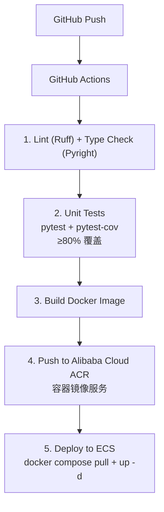

### 12.4 监控与告警

| 层面 | 工具 | 指标 |
|---|---|---|
| 应用性能 | Sentry | API 错误率、响应时间 P95 |
| 服务器 | 阿里云云监控 | CPU、内存、磁盘、网络 |
| 数据库 | RDS 控制台 + pg_stat_statements | 慢查询、连接数、复制延迟 |
| 搜索 | Elasticsearch Kibana | 搜索延迟、索引大小、无结果率 |
| 业务 | 自建统计表 | 上传量、下载量、审核队列积压 |

---

## 13. 合规与隐私

### 13.1 PIPL (个人信息保护法) 合规

| 要求 | 实施措施 |
|---|---|
| **知情同意** | 注册时单独勾选：收集手机号、处理敏感信息（学号）、分享给第三方 |
| **数据最小化** | 仅收集手机号、学号(可选)、昵称、头像。不收集位置、通讯录、设备 ID |
| **未成年人 (<14岁)** | 原则上大学平台用户均 ≥18 岁，但注册流程增加年龄确认步骤 |
| **数据跨境** | **全量部署于中国大陆**，无跨境传输。使用阿里云中国 Region |
| **数据留存** | 账号注销后 30 天内删除 PII；上传资料匿名化或转移所有权 |
| **删除权** | 提供"注销账号"功能，自动清除 PII + 匿名化贡献记录 |
| **安全事件通知** | 数据泄露 72 小时内通知受影响用户 + 网信办 |

### 13.2 PII 加密策略

| 数据 | 加密方式 | 存储位置 |
|---|---|---|
| 手机号 | AES-256-GCM（应用层加密） | users 表，ciphertext 列 |
| 学号 | AES-256-GCM（应用层加密） | users 表，ciphertext 列 |
| 密码 (如有) | bcrypt (cost=12) | users 表 |
| JWT Secret | 环境变量 / 密钥管理服务 | 不存储在代码仓库 |
| 数据库静态加密 | RDS TDE (透明数据加密) | 一键开启 |

### 13.3 等保 2.0

作为处理学生数据的平台，预计需要等保二级认证：
- 预算约 ¥50,000-100,000
- 需要由 CAC 认可的测评机构进行正式安全评估
- MVP 阶段可先按等保二级标准建设，上线后补充认证

### 13.4 版权合规

- 实施"通知-删除"机制（中国《信息网络传播权保护条例》）
- 提供公开的版权投诉入口
- 48 小时内响应有效投诉
- 维护已知版权限制教材的标题屏蔽列表
- 审核流程中标记疑似版权风险内容
- 动态盲水印溯源：所有预览页面叠加用户 UUID + 时间戳的半透明水印（opacity 0.06-0.10），截图可追溯到人。当面临校方或出版社施压时，水印机制是证明平台具备内容溯源能力的关键防御措施——虽不能阻止截图，但能有效威慑恶意传播，且为 DMCA/版权投诉提供技术层面的合规诚意证据

---

## 附录 A: 关键依赖清单

### 前端 (scustack-web)

```json
{
  "dependencies": {
    "nuxt": "^3.12",
    "vue": "^3.5",
    "element-plus": "^2.8",
    "pinia": "^2.2",
    "@vueuse/core": "^10.11",
    "pdfjs-dist": "^4.5",
    "shiki": "^1.14",
    "diff-match-patch": "^1.0.5",
    "dayjs": "^1.11",
    "axios": "^1.7"
  },
  "devDependencies": {
    "typescript": "^5.5",
    "@nuxtjs/tailwindcss": "^6.12",
    "vitest": "^1.6",
    "@playwright/test": "^1.44"
  }
}
```

### 后端 (scustack-api)

```toml
[project]
dependencies = [
    "fastapi>=0.112,<1",
    "uvicorn[standard]>=0.30",
    "gunicorn>=22",
    "sqlalchemy[asyncio]>=2.0",
    "asyncpg>=0.29",
    "alembic>=1.13",
    "pydantic>=2.8",
    "pydantic-settings>=2.3",
    "redis[hiredis]>=5.0",
    "elasticsearch-py[async]>=8.14",
    "oss2>=2.18",
    "celery>=5.4",
    "python-jose[cryptography]>=3.3",
    "passlib[bcrypt]>=1.7",
    "diff-match-patch>=20230430",
    "httpx>=0.27",
    "sentry-sdk[fastapi]>=2.8",
]

[project.optional-dependencies]
dev = [
    "pytest>=8.2",
    "pytest-asyncio>=0.23",
    "pytest-cov>=5.0",
    "ruff>=0.5",
    "pyright>=1.1",
]
```

---

## 附录 B: 环境变量清单

```bash
# 应用
SCUSTACK_APP_ENV=prod
SCUSTACK_DEBUG=false

# 数据库
SCUSTACK_DB_HOST=<rds-host>
SCUSTACK_DB_PORT=5432
SCUSTACK_DB_USER=<db-user>
SCUSTACK_DB_PASSWORD=<db-password>
SCUSTACK_DB_NAME=scustack
SCUSTACK_DB_POOL_SIZE=20

# Redis
SCUSTACK_REDIS_URL=redis://redis.internal:6379/0

# Elasticsearch
SCUSTACK_ES_HOST=http://es.internal:9200

# 阿里云
SCUSTACK_OSS_ENDPOINT=https://oss-cn-chengdu.aliyuncs.com
SCUSTACK_OSS_BUCKET=scustack-files
SCUSTACK_OSS_ACCESS_KEY_ID=<key>
SCUSTACK_OSS_ACCESS_KEY_SECRET=<secret>

# 短信服务 (阿里云 SMS)
SCUSTACK_SMS_ACCESS_KEY_ID=<key>
SCUSTACK_SMS_ACCESS_KEY_SECRET=<secret>
SCUSTACK_SMS_SIGN_NAME=川流课栈
SCUSTACK_SMS_TEMPLATE_CODE=SMS_123456789

# 微信开放平台
SCUSTACK_WECHAT_APP_ID=<app-id>
SCUSTACK_WECHAT_APP_SECRET=<secret>

# JWT
SCUSTACK_JWT_SECRET_KEY=<random-64-char>
SCUSTACK_JWT_ALGORITHM=HS256
SCUSTACK_ACCESS_TOKEN_EXPIRE_MINUTES=15
SCUSTACK_REFRESH_TOKEN_EXPIRE_DAYS=7

# 加密
SCUSTACK_ENCRYPTION_KEY=<random-64-char>

# Sentry
SCUSTACK_SENTRY_DSN=https://xxx@sentry.io/xxx
```

---

> **文档版本**: v1.1 | **作者**: 技术架构团队 | **最后更新**: 2026-06-17
>
> **v1.1 更新**: 同步实际代码现状 — §11.1 覆盖全部 96 个 API 端点（新增 /me/*, /wishes, /comments, /bookmarks, /collections, /corrections, /copyright, /homepage, /about, /feedback, /health, admin 扩展端点）；§3 更新为 22 个服务文件 + 18 个路由文件；§4.3 新增完整模型清单（22 文件 / 27 模型类）。
