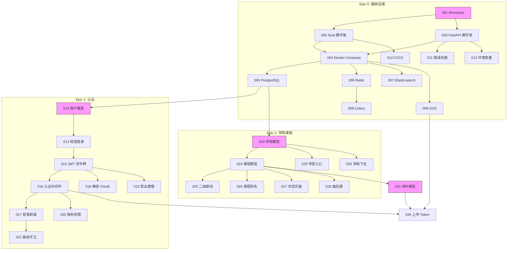

# 川大课栈 Issue 分解

> 共计 120 个 issue，按 14 个 Epic 分组，按依赖关系排序。
> HITL = 需人工决策，AFK = 可独立完成。

---

## Epic 0: 项目基础设施 (12 issues)

### ISSUE-001: Monorepo 初始化与包管理器配置
- **Type**: HITL
- **Blocked by**: None
- **User stories**: —
- **What to build**: 初始化 pnpm workspace monorepo，创建 `scustack-web/` (Nuxt 3) 和 `scustack-api/` (FastAPI) 两个包，配置共享 TypeScript types 包、ESLint/Prettier 规则。
- **Acceptance**: `pnpm install` 成功安装所有依赖；`pnpm dev` 同时启动前后端。

### ISSUE-002: Nuxt 3 脚手架与 Tailwind + Element Plus 集成
- **Type**: AFK
- **Blocked by**: ISSUE-001
- **User stories**: —
- **What to build**: 使用 `nuxi init` 创建 Nuxt 3 项目，安装 Tailwind CSS、Element Plus、Pinia。配置 `nuxt.config.ts`（SSR/ISR/CSR routeRules）、全局 CSS 变量映射设计 Token。
- **Acceptance**: `pnpm dev` 启动 Nuxt 开发服务器，Element Plus 组件可正常渲染，Tailwind class 生效。

### ISSUE-003: FastAPI 脚手架与分层架构
- **Type**: AFK
- **Blocked by**: ISSUE-001
- **User stories**: —
- **What to build**: 创建 FastAPI 应用骨架，建立 `api/v1/` 路由结构、`models/`、`schemas/`、`services/`、`core/` 分层目录。挂载 `/api/v1/health` 健康检查端点。
- **Acceptance**: `uvicorn app.main:app --reload` 启动，`GET /api/v1/health` 返回 200。

### ISSUE-004: Docker Compose 开发环境
- **Type**: HITL
- **Blocked by**: ISSUE-002, ISSUE-003
- **User stories**: —
- **What to build**: 编写 `docker-compose.yml`，包含 PostgreSQL 16、Redis 7、Elasticsearch 8、OnlyOffice DocumentServer 服务。配置环境变量文件和 volume 挂载。
- **Acceptance**: `docker compose up` 启动所有服务；前后端可连接至各服务。

### ISSUE-005: PostgreSQL 数据库与 Alembic 迁移框架
- **Type**: AFK
- **Blocked by**: ISSUE-004
- **User stories**: —
- **What to build**: 配置 SQLAlchemy 2.0 async engine + asyncpg 驱动，初始化 Alembic 迁移。创建 `users` 表作为首个迁移。
- **Acceptance**: `alembic upgrade head` 成功建表；FastAPI 可通过 async session 读写数据库。

### ISSUE-006: Redis 缓存与会话基础设施
- **Type**: AFK
- **Blocked by**: ISSUE-004
- **User stories**: —
- **What to build**: 封装 Redis 客户端（含连接池），实现 `cache_get`/`cache_set`/`cache_delete` 工具函数。编写速率限制计数器的基础实现（滑动窗口）。
- **Acceptance**: Redis 读写正常；速率限制计数器单元测试通过。

### ISSUE-007: Elasticsearch 索引基础设施与 IK 分词器
- **Type**: AFK
- **Blocked by**: ISSUE-004
- **User stories**: —
- **What to build**: 配置 Elasticsearch 连接，安装 IK 分词器插件，创建 `materials` 索引 mapping（含 `ik_smart`/`ik_max_word` analyzer）。封装 ES 异步客户端。
- **Acceptance**: 可通过 API 创建索引、写入测试文档、执行中文搜索查询。

### ISSUE-008: 阿里云 OSS 集成与 Presigned URL
- **Type**: AFK
- **Blocked by**: ISSUE-004
- **User stories**: —
- **What to build**: 封装 OSS 客户端，实现 `generate_upload_token(file_name, content_type, size) -> presigned_url` 和 `generate_download_url(storage_key) -> presigned_url`。
- **Acceptance**: 可生成有效的 Presigned PUT URL 并上传文件至 OSS；可生成 Presigned GET URL 并下载。

### ISSUE-009: Celery 异步任务基础设施
- **Type**: AFK
- **Blocked by**: ISSUE-006
- **User stories**: —
- **What to build**: 配置 Celery app（Redis broker），创建 `tasks/` 目录结构，定义 default/scan/thumbnail 三个队列，编写示例异步任务验证链路通畅。
- **Acceptance**: Celery worker 启动并消费任务；任务执行结果可查询。

### ISSUE-010: GitHub Actions CI/CD 流水线
- **Type**: HITL
- **Blocked by**: ISSUE-002, ISSUE-003
- **User stories**: —
- **What to build**: 编写 GitHub Actions workflow：Lint (Ruff + ESLint)、Type Check (Pyright + Vue TSC)、Unit Tests (pytest + vitest)、Docker Build、Push to ACR。
- **Acceptance**: Push 触发 CI 自动运行；所有步骤通过。

### ISSUE-011: 全局错误处理与 API 响应格式
- **Type**: AFK
- **Blocked by**: ISSUE-003
- **User stories**: —
- **What to build**: 实现 FastAPI exception handler，统一错误响应格式 `{code, data, message, detail}`。实现成功响应包装 `{code: 0, data, message: "ok"}`。定义错误码枚举。
- **Acceptance**: 所有 API 端点返回统一格式；未处理异常返回 500 格式。

### ISSUE-012: 项目配置管理与环境变量
- **Type**: AFK
- **Blocked by**: ISSUE-003
- **User stories**: —
- **What to build**: 使用 pydantic-settings 管理所有配置项，定义 `.env.example`，区分 dev/staging/prod 环境。前端使用 Nuxt runtimeConfig。
- **Acceptance**: 所有环境变量可通过类型安全的方式访问；敏感值不出现在代码仓库。

---

## Epic 1: 认证与用户系统 (10 issues)

### ISSUE-013: 用户数据模型与迁移
- **Type**: AFK
- **Blocked by**: ISSUE-005
- **User stories**: —
- **What to build**: 创建 `users` 表完整 DDL（UUID 主键、手机号 AES-256 加密、昵称、头像、角色、微信 openid、学号加密、信任分）。同时创建 `refresh_tokens` 表。
- **Acceptance**: Alembic 迁移成功建表；phone/university_id 在应用层加解密正常。

### ISSUE-014: 手机号短信验证码登录
- **Type**: AFK
- **Blocked by**: ISSUE-013
- **User stories**: #1 (搜索课程的前提是登录)
- **What to build**: `POST /api/v1/auth/sms/send`（3次/10min 限制）、`POST /api/v1/auth/sms/verify`（验证码登录，新用户自动注册）。集成阿里云 SMS SDK。
- **Acceptance**: 发送验证码 → 输入正确验证码 → 登录成功返回 JWT；新用户首次登录自动创建账号。

### ISSUE-015: JWT 双令牌认证系统
- **Type**: AFK
- **Blocked by**: ISSUE-014
- **User stories**: —
- **What to build**: 实现 JWT Access Token (15min) + Refresh Token (7天) 签发与校验。Token 存储于 httpOnly Cookie（Secure, SameSite=Lax）。实现 Refresh Token 轮换与复用检测。
- **Acceptance**: 登录返回双令牌；Access Token 过期后可用 Refresh Token 刷新；旧 Refresh Token 复用触全局撤销。

### ISSUE-016: 认证中间件与依赖注入
- **Type**: AFK
- **Blocked by**: ISSUE-015
- **User stories**: —
- **What to build**: 实现 `get_current_user` FastAPI dependency（解码 JWT，查询用户，检查 is_active）。实现 `require_permission` dependency factory。
- **Acceptance**: 受保护端点无 Token 返回 401；无效 Token 返回 401；有效 Token 注入 current_user。

### ISSUE-017: 登录注册前端页面
- **Type**: AFK
- **Blocked by**: ISSUE-016
- **User stories**: #34 (首次访问无需学习 Git 就能使用)
- **What to build**: 实现手机号登录 Modal（手机号输入 → 验证码输入 → 登录成功）。集成倒计时按钮。实现全局 auth store (Pinia)。未登录时导航栏显示"登录"按钮。
- **Acceptance**: 点击登录 → 弹窗 → 输手机号 → 收验证码 → 登录成功 → Modal 关闭 → 导航栏显示头像。

### ISSUE-018: 微信 OAuth 登录
- **Type**: AFK
- **Blocked by**: ISSUE-015
- **User stories**: —
- **What to build**: `POST /api/v1/auth/wechat/url` 生成授权链接、`POST /api/v1/auth/wechat/callback` 处理回调。微信用户首次登录自动创建账号，已绑定手机号则关联。
- **Acceptance**: 微信扫码 → 授权 → 回调 → 登录成功返回 JWT。

### ISSUE-019: 登出与会话管理
- **Type**: AFK
- **Blocked by**: ISSUE-015
- **User stories**: —
- **What to build**: `POST /api/v1/auth/logout` 清除 httpOnly Cookie + 撤销当前 Refresh Token。实现"我的设备"列表（查看/撤销活跃 Refresh Token）。30 天无活动自动过期。
- **Acceptance**: 登出后 Cookie 清除；Refresh Token 不可再用于刷新。

### ISSUE-020: 角色与权限系统
- **Type**: AFK
- **Blocked by**: ISSUE-016
- **User stories**: —
- **What to build**: 实现 Capability-based RBAC：定义 Permission enum（materials:read/create/delete/moderate/pin, users:manage, audit:read），映射 Role→Permissions（visitor/student/contributor/maintainer/admin）。
- **Acceptance**: 不同角色用户访问受保护端点，权限正确生效（403/通过）。

### ISSUE-021: 前端路由守卫与角色中间件
- **Type**: AFK
- **Blocked by**: ISSUE-017, ISSUE-020
- **User stories**: —
- **What to build**: Nuxt middleware：`auth.ts`（未登录重定向至首页+弹登录窗）、`role.ts`（无权限显示 403 页面）。Pinia auth store 自动刷新 Token。
- **Acceptance**: 未登录访问 `/upload` → 跳转首页 + 弹登录框；无权限访问 `/admin` → 显示 403。

### ISSUE-022: 认证系统集成测试
- **Type**: AFK
- **Blocked by**: ISSUE-017, ISSUE-019
- **User stories**: —
- **What to build**: 编写 pytest 测试：手机号登录流程、Token 刷新、Token 过期、Refresh Token 复用检测、角色权限校验、登出。前端 vitest：auth store 状态流转。
- **Acceptance**: 所有 auth 相关测试通过；覆盖率 > 90%。

---

## Epic 2: 学院与课程目录 (10 issues)

### ISSUE-023: 学院数据模型与管理 API
- **Type**: AFK
- **Blocked by**: ISSUE-005
- **User stories**: #2 (按学院浏览资料)
- **What to build**: 创建 `colleges` 表（name, slug, sort_order）。实现 CRUD API（admin 写入，所有人读取）。种子数据：导入四川大学全部学院列表（~30 个学院）。
- **Acceptance**: `GET /api/v1/colleges` 返回学院列表（按 sort_order）；`POST /api/v1/colleges` 仅 admin 可调用。

### ISSUE-024: 课程数据模型与管理 API
- **Type**: AFK
- **Blocked by**: ISSUE-023
- **User stories**: #2 (按课程浏览资料)
- **What to build**: 创建 `courses` 表（college_id FK, name, slug, aliases JSONB, description, credit, category）。实现 CRUD API（maintainer+ 写入），支持 `?college_id=` 筛选。GIN 索引 `zhparser(name)`。
- **Acceptance**: `GET /api/v1/courses?college_id=xxx` 返回课程列表；`POST /api/v1/courses` maintainer+ 可创建。

### ISSUE-025: 学院-课程二级联动选择器
- **Type**: AFK
- **Blocked by**: ISSUE-024
- **User stories**: #23 (贡献者标注课程)
- **What to build**: Vue 组件 `CollegeCourseSelect`：先选择学院（异步加载学院列表），选中后异步加载该学院下的课程（带本地搜索过滤）。用于上传表单和筛选面板。
- **Acceptance**: 选学院 → 课程下拉自动加载；支持输入关键词过滤课程列表。

### ISSUE-026: 课程别名管理
- **Type**: AFK
- **Blocked by**: ISSUE-024
- **User stories**: #32 (维护者合并重复课程/别名)
- **What to build**: `courses.aliases` JSONB 字段的 CRUD。课程搜索时，alias 命中 → 返回对应的正式课程。`POST /api/v1/courses/:id/merge` 合并两个课程（资料迁移至目标课程，源课程标记 is_active=false）。
- **Acceptance**: 搜索"高数"命中课程"高等数学A"；合并后原课程下资料全部迁移。

### ISSUE-027: 学院列表与课程浏览前端页面
- **Type**: AFK
- **Blocked by**: ISSUE-024
- **User stories**: #2 (按学院/课程浏览)
- **What to build**: `/colleges` 页面列出所有学院（卡片网格），点击进入学院详情（课程列表 + 资料计数）。每个课程卡片：课程名、别名、分类、学分、资料数。
- **Acceptance**: 学院列表 → 点击学院 → 课程列表 → 点击课程 → 课程详情页。

### ISSUE-028: 面包屑导航组件
- **Type**: AFK
- **Blocked by**: ISSUE-024
- **User stories**: #2 (了解当前位置)
- **What to build**: `Breadcrumb` 组件，自动根据路由和课程/学院数据生成面包屑。`首页 > 学院名 > 课程名` 或 `首页 > 资料详情 > 资料标题`。支持 `< 640px` 时折叠为返回箭头+当前页标题。
- **Acceptance**: 课程详情页显示完整面包屑；各层级可点击跳转；移动端折叠。

### ISSUE-029: 学院快速入口（首页组件）
- **Type**: AFK
- **Blocked by**: ISSUE-023
- **User stories**: #2
- **What to build**: 首页底部"学院快速入口"区域：横向滚动 Pill 列表，每个 Pill 显示学院名和资料数量。点击跳转学院页。
- **Acceptance**: 首页底部展示学院 Pill 列表；横向可滑动；点击跳转。

### ISSUE-030: 导航栏全局学院下拉
- **Type**: AFK
- **Blocked by**: ISSUE-023
- **User stories**: #2
- **What to build**: 导航栏"学院"改为下拉菜单，hover/点击展开学院列表（分组显示或搜索过滤）。
- **Acceptance**: 点击导航栏"学院" → 下拉展示学院列表 → 点击直接跳转。

### ISSUE-031: 课程数据种子脚本
- **Type**: HITL
- **Blocked by**: ISSUE-024
- **User stories**: —
- **What to build**: 编写 Python 脚本从 CSV/JSON 导入课程数据（学院、课程名、分类、学分），包含四川大学主要的通识必修课和热门专业课。定义分类和别名映射。需人工审核课程数据的准确性。
- **Acceptance**: 执行种子脚本后，数据库包含完整的学院和课程数据。

### ISSUE-032: 学院与课程模块测试
- **Type**: AFK
- **Blocked by**: ISSUE-024, ISSUE-025
- **User stories**: —
- **What to build**: pytest：学院 CRUD、课程 CRUD、别名搜索、课程合并。前端 vitest：选择器组件联动逻辑。E2E (Playwright)：浏览学院→课程→资料完整路径。
- **Acceptance**: 所有测试通过；E2E 覆盖主要用户路径。

---

## Epic 3: 资料上传与管理 (12 issues)

### ISSUE-033: 资料数据模型与迁移
- **Type**: AFK
- **Blocked by**: ISSUE-024
- **User stories**: #18 (上传时填写结构化元数据)
- **What to build**: 创建 `materials` 表（course_id FK, title, description, category, semester, teacher, source_type, external_url, format, file_size, file_hash, trust_status, review_status, average_rating, rating_count, download_count, is_pinned, contributor_id）。创建所有索引。
- **Acceptance**: 迁移成功建表；所有索引生效（通过 EXPLAIN 验证）。

### ISSUE-034: 文件上传 Presigned URL API
- **Type**: AFK
- **Blocked by**: ISSUE-008, ISSUE-016
- **User stories**: #22 (上传表单引导填写)
- **What to build**: `POST /api/v1/upload/token` 端点：验证登录→校验扩展名白名单→校验文件大小→生成 OSS Presigned PUT URL（5min 有效）→返回 URL 和 storage_key。
- **Acceptance**: 已登录用户请求 → 返回有效 Presigned URL；未登录 → 401；非法扩展名 → 400。

### ISSUE-035: 前端文件上传区域组件 (DropZone)
- **Type**: AFK
- **Blocked by**: ISSUE-034
- **User stories**: #22
- **What to build**: `DropZone` 组件：虚线拖拽区域（Default/DragOver/Selected/Uploading/Error 五态）。展示文件格式图标 + 文件名 + 大小。上传进度条。支持扩展名白名单前端预校验。
- **Acceptance**: 拖拽文件 → 高亮 → 松开 → 显示文件信息；点击 → 文件选择器；上传中显示进度。

### ISSUE-036: 客户端 SHA-256 预计算与去重检查
- **Type**: AFK
- **Blocked by**: ISSUE-033, ISSUE-035
- **User stories**: #27 (重复检测)
- **What to build**: `POST /api/v1/upload/check-duplicate` 端点（接收 SHA-256，查询 material_versions.file_hash）。前端使用 Web Crypto API (`SubtleCrypto.digest('SHA-256')`) 在上传前计算文件哈希。
- **Acceptance**: 上传已有文件 → 前端提示"该文件已存在" + 链接到已有资料；新文件 → 允许上传。

### ISSUE-037: 文件安全校验管道
- **Type**: AFK
- **Blocked by**: ISSUE-034
- **User stories**: —
- **What to build**: 实现 6 层校验：①文件大小（PDF<50MB/视频<200MB/其他<100MB）②扩展名白名单 ③Magic Bytes 校验（文件头 vs 声明格式）④ZIP Bomb 检测（压缩比>100:1 拒绝）⑤ClamAV 病毒扫描（Celery 异步）⑥存储隔离。
- **Acceptance**: 上传非法格式 → 拒绝并返回具体原因；Magic Bytes 伪造的 PDF → 拒绝；ZIP Bomb → 拒绝。

### ISSUE-038: 资料创建 API
- **Type**: AFK
- **Blocked by**: ISSUE-033
- **User stories**: #18 (结构化元数据上传)
- **What to build**: `POST /api/v1/materials`：接收 title/course_id/category/semester/teacher/source_type/description/tags。托管文件：关联已上传的 storage_key 和 file_hash。外部链接：验证 URL 格式。自动设置 review_status='pending'。触发 Celery 任务（病毒扫描、缩略图、ES 索引）。
- **Acceptance**: 完整元数据提交 → 资料创建成功 → review_status=pending；必填字段缺失 → 400 + 字段级错误。

### ISSUE-039: 资料创建前端（上传表单页）
- **Type**: AFK
- **Blocked by**: ISSUE-025, ISSUE-035, ISSUE-038
- **User stories**: #18, #22, #23
- **What to build**: `/upload` 页面：完整上传表单。字段：标题（max 200 字计数器）、学院-课程二级联动、分类 Pill 选择器、学期下拉、教师（可选）、来源类型 Radio、DropZone/URL 输入框、描述 textarea（Markdown）、标签输入器。底部"保存草稿"+"提交审核"。实现 localStorage 草稿自动保存（30s）。
- **Acceptance**: 完整填写 → 提交 → Loading → Toast"已提交审核" → 跳转我的贡献；表单校验失败 → 字段级错误提示。

### ISSUE-040: 外部链接资料提交
- **Type**: AFK
- **Blocked by**: ISSUE-038, ISSUE-039
- **User stories**: #19 (提交外部资源链接)
- **What to build**: 当 source_type='external' 时，显示 URL 输入框。自动尝试获取链接标题（OG meta）。资料卡片上外部链接显示外链图标 + 域名标注。
- **Acceptance**: 提交有效 URL → 创建外部链接资料；点击 → 新标签页打开（rel="noopener noreferrer nofollow"）。

### ISSUE-041: 资料编辑与版本更新 API
- **Type**: AFK
- **Blocked by**: ISSUE-038
- **User stories**: #20 (替换/修订资料)
- **What to build**: `PATCH /api/v1/materials/:id`（仅 own 或 maintainer+）。更新元数据字段。`POST /api/v1/materials/:id/versions`（上传新版本文件，含 change_note）。更新后 trust_status 重置为 unverified（需重新审核）。
- **Acceptance**: 贡献者编辑自己的资料 → 成功更新；编辑他人资料 → 403；上传新版本 → 版本号+1。

### ISSUE-042: 资料删除与软删除
- **Type**: AFK
- **Blocked by**: ISSUE-041
- **User stories**: —
- **What to build**: `DELETE /api/v1/materials/:id`（own 或 maintainer+）。软删除：review_status → 'removed'，资料详情页显示"该资料已移除"。硬删除（admin only）：60 天后自动清理 removed 状态资料及其关联文件。
- **Acceptance**: 删除 → 资料不可公开访问；维护者仍可查看已移除记录。

### ISSUE-043: Celery 异步任务：病毒扫描与缩略图
- **Type**: AFK
- **Blocked by**: ISSUE-009, ISSUE-038
- **User stories**: —
- **What to build**: `virus_scan` 任务：调用 ClamAV 扫描上传文件，发现病毒 → 设置 review_status='rejected'。`thumbnail` 任务：PDF→PyMuPDF 截首页、Office→LibreOffice headless 转 PDF→PyMuPDF、图片→Pillow 缩放至 256px WebP。
- **Acceptance**: 上传完成后自动触发扫描；缩略图生成并上传至 OSS thumbs/ 目录。

### ISSUE-044: 上传模块集成测试
- **Type**: AFK
- **Blocked by**: ISSUE-039, ISSUE-043
- **User stories**: —
- **What to build**: pytest：上传 token、去重检查、安全校验管道、资料创建/编辑/删除。前端 vitest：DropZone 状态、表单校验、草稿保存。E2E：完整上传流程（选文件→填表单→提交→审核）。
- **Acceptance**: 所有测试通过；E2E 覆盖 happy path + error cases。

---

## Epic 4: 搜索系统 (10 issues)

### ISSUE-045: Elasticsearch 资料索引同步
- **Type**: AFK
- **Blocked by**: ISSUE-007, ISSUE-033
- **User stories**: #15 (全文搜索)
- **What to build**: Celery 任务 `sync_material_to_es`：资料创建/更新/删除时，同步至 ES `materials` 索引。实现 `MaterialDocument` 数据类（ES 文档 ↔ DB 记录的映射）。初始化时全量同步已有资料。
- **Acceptance**: 创建资料 → ES 中可立即搜索到；删除资料 → ES 中移除。

### ISSUE-046: 搜索 API 端点
- **Type**: AFK
- **Blocked by**: ISSUE-045
- **User stories**: #15, #16, #17
- **What to build**: `GET /api/v1/search?q=&college=&course_id=&category=&semester=&source_type=&format=&sort=&page=&page_size=`。ES DSL 查询：multi_match (title, description, course_name, aliases) + IK 分词 + filter terms + function_score 排序（BM25 + trust_status 加权 + rating 加权 + downloads 加权 + created_at 衰减）。
- **Acceptance**: 搜索"高等数学" → 返回相关资料；筛选 + 排序组合生效；分页正常。

### ISSUE-047: 搜索自动补全 API
- **Type**: AFK
- **Blocked by**: ISSUE-045
- **User stories**: #15
- **What to build**: `GET /api/v1/search/suggest?q=`。返回分类结果："课程"（匹配的课程名 + college_name）+ "资料"（匹配的资料标题）。使用 ES Completion Suggester 或 edge_ngram。
- **Acceptance**: 输入"高" → 返回"高等数学""高等代数"等建议，分类显示。

### ISSUE-048: 全局搜索框组件
- **Type**: AFK
- **Blocked by**: ISSUE-047
- **User stories**: #15, #34
- **What to build**: `SearchBar` 组件：导航栏版本（h-10）和 Hero 版本（h-14）。输入 debounce 300ms 触发自动补全请求（`AbortController` 取消上次请求）。自动补全下拉面板（分类显示 + 键盘 ↑↓ 导航 + 高亮匹配文字）。回车/点击 → 跳转搜索结果页。
- **Acceptance**: 输入文字 → debounce → 显示补全下拉；点击补全项 → 跳转；Esc → 关闭下拉。

### ISSUE-049: 搜索结果页面前端
- **Type**: AFK
- **Blocked by**: ISSUE-046, ISSUE-048
- **User stories**: #16 (搜索结果展示元数据), #17 (按相关度等排序)
- **What to build**: `/search` 页面：顶部搜索结果计数 + 排序标签（相关度/最新/最多下载/最高评分）。左侧筛选面板（desktop sticky / mobile Bottom Sheet）：学院、资料分类、学期、格式、来源、信任状态，每个筛选项显示命中计数。右侧资料卡片列表（MaterialCard），关键词高亮（`<mark>`）。
- **Acceptance**: 搜索 → 结果卡片 + 筛选面板 + 排序切换全部正常；筛选即时生效；URL query string 同步。

### ISSUE-050: 搜索无结果状态
- **Type**: AFK
- **Blocked by**: ISSUE-049
- **User stories**: —
- **What to build**: 搜索无结果时显示空状态：插画 + "未找到相关资料" + "试试修改搜索关键词" + "浏览学院目录"按钮 + "提交资料请求"链接。追踪搜索无结果关键词（写入 analytics 日志）。
- **Acceptance**: 搜索无结果 → 显示空状态 + 引导出口；无结果关键词被记录。

### ISSUE-051: IK 分词器自定义词典
- **Type**: HITL
- **Blocked by**: ISSUE-046
- **User stories**: —
- **What to build**: 编写 IK `ext_dict` 自定义词典文件：四川大学学院名、专业名、课程名、教材全称/简称、常见教学术语。配置热加载（不需重启 ES）。需人工审核词典内容覆盖度。
- **Acceptance**: 词典加载后，搜索"毛概"可命中"毛泽东思想概论"；搜索"大物"命中"大学物理"。

### ISSUE-052: 课程内搜索与筛选
- **Type**: AFK
- **Blocked by**: ISSUE-046
- **User stories**: #15
- **What to build**: 课程详情页内嵌搜索框：仅搜索当前课程下的资料。筛选器：分类、学期、格式、来源、信任状态（多选下拉）。排序标签。
- **Acceptance**: 在课程页搜索 → 仅返回该课程下的资料；筛选和排序正常工作。

### ISSUE-053: 搜索回溯与 URL 分享
- **Type**: AFK
- **Blocked by**: ISSUE-049
- **User stories**: —
- **What to build**: 搜索条件和关键词完全编码到 URL query string。浏览器前进/后退按钮可回溯搜索历史。点击分享按钮复制当前搜索 URL。
- **Acceptance**: 搜索"高等数学"→ 筛选"考试资料"→ URL 包含所有参数 → 复制 URL 在新窗口打开 → 结果一致。

### ISSUE-054: 搜索模块测试
- **Type**: AFK
- **Blocked by**: ISSUE-049
- **User stories**: —
- **What to build**: pytest：搜索 API 关键词/筛选/排序/分页/空结果/别名匹配/中英混合。前端 vitest：SearchBar 补全逻辑、URL 同步。E2E：搜索→筛选→排序→点击结果完整链路。
- **Acceptance**: 所有测试通过；ES 搜索延迟 P95 < 50ms。

---

## Epic 5: 文件预览 (8 issues)

### ISSUE-055: PDF 预览（PDF.js）
- **Type**: AFK
- **Blocked by**: ISSUE-002
- **User stories**: #6 (在线预览文档)
- **What to build**: 集成 PDF.js 到 Nuxt 项目。`FilePreview` 容器内加载 PDF，支持翻页、缩放、搜索。Canvas 层叠加 PDF 渲染 + 半透明盲水印层（UUID 后 8 位 + 时间戳）。
- **Acceptance**: PDF 文件可在线预览；翻页/缩放正常；水印可见但不过度干扰阅读。

### ISSUE-056: Office 文档预览（OnlyOffice）
- **Type**: AFK
- **Blocked by**: ISSUE-004
- **User stories**: #6
- **What to build**: 配置 OnlyOffice DocumentServer，安装中文字体（Noto Sans CJK SC + LXGW WenKai）。`FilePreview` 通过 iframe 嵌入 OnlyOffice Viewer API。配置 OnlyOffice 自定义水印 API 叠加盲水印。
- **Acceptance**: DOCX/PPTX/XLSX 文件在线预览；中文渲染正确无乱码；水印叠加。

### ISSUE-057: 代码与 Markdown 预览（Shiki）
- **Type**: AFK
- **Blocked by**: ISSUE-002
- **User stories**: #6
- **What to build**: `CodePreview` 组件：使用 Shiki + TextMate grammar 渲染代码文件（.py, .js, .ts, .c, .cpp, .java, .html, .css）。`MarkdownPreview` 组件：使用 remark/rehype + Shiki 渲染 Markdown 为 HTML。支持明/暗主题切换。
- **Acceptance**: 代码文件显示语法高亮（VS Code 级）；Markdown 渲染包括代码块、表格、图片。

### ISSUE-058: 图片与纯文本预览
- **Type**: AFK
- **Blocked by**: ISSUE-002
- **User stories**: #6
- **What to build**: 图片：使用原生 `` + 阿里云图片处理参数（缩放、格式转换）显示。右上角叠加盲水印。纯文本：`<pre>` 渲染，大文件（>500 行）截断并显示"查看全部"按钮。
- **Acceptance**: 图片正常显示 + 水印；文本预览行数限制生效。

### ISSUE-059: 预览容器与文件类型路由
- **Type**: AFK
- **Blocked by**: ISSUE-055, ISSUE-056, ISSUE-057, ISSUE-058
- **User stories**: #6
- **What to build**: `FilePreview` 容器组件：根据文件格式自动选择预览引擎（PDF→PDF.js, DOCX/PPTX/XLSX→OnlyOffice, 代码→Shiki, MD→Markdown, 图片→img, 文本→pre）。加载中显示 Spinner；加载失败降级为"直接下载"按钮。
- **Acceptance**: 打开不同格式文件 → 自动路由到正确预览引擎；预览失败降级。

### ISSUE-060: 动态盲水印实现
- **Type**: AFK
- **Blocked by**: ISSUE-055
- **User stories**: #37 (隐私)
- **What to build**: 水印层工具函数：生成水印内容（UUID 后 8 位 + 日期时间），CSS 水印模板（opacity 0.06, 平铺，用户不可编辑）。PDF Canvas 叠加层、OnlyOffice 水印 API、OSS 图片水印参数、代码/MD CSS 伪元素。
- **Acceptance**: 所有预览模式均可见水印；不同用户看到不同水印；截图可追溯到人。

### ISSUE-061: 缩略图生成 Celery 任务
- **Type**: AFK
- **Blocked by**: ISSUE-043
- **User stories**: —
- **What to build**: 完善第 ISSUE-043 中的缩略图任务：所有文件类型在资料卡片显示对应缩略图/格式图标。PDF/Office 显示首页缩略图，代码显示语法高亮截图，图片显示缩略图。
- **Acceptance**: 资料卡片上显示正确的缩略图或格式图标。

### ISSUE-062: 文件预览模块测试
- **Type**: AFK
- **Blocked by**: ISSUE-059
- **User stories**: —
- **What to build**: E2E：各文件格式预览、水印准确性、预览失败降级、Pdf.js 翻页和搜索、OnlyOffice 中文字体。
- **Acceptance**: 所有预览场景 E2E 通过。

---

## Epic 6: 资料详情与版本管理 (10 issues)

### ISSUE-063: 资料详情页面前端
- **Type**: AFK
- **Blocked by**: ISSUE-038, ISSUE-028
- **User stories**: #5 (资料分类), #9 (评分), #11 (信任验证)
- **What to build**: `/material/:id` 页面：左栏（8/12）— 标题+信任徽章+元数据行+描述+预览容器+版本时间线。右栏（4/12, sticky）— 操作卡片（预览/下载/评分/举报/分享）+ 评分分布 + 资料信息 + 相关推荐。移动端右栏移至下方。
- **Acceptance**: 资料详情页完整渲染；左栏/右栏布局正确；移动端单列。

### ISSUE-064: 资料版本历史 API 与时间线
- **Type**: AFK
- **Blocked by**: ISSUE-033, ISSUE-041
- **User stories**: #20 (版本更新说明)
- **What to build**: 创建 `material_versions` 表（material_id, version_number, file_hash, storage_key, file_size, change_note, uploaded_by）。`GET /api/v1/materials/:id/versions` 返回版本列表。`VersionTimeline` 组件：垂直时间线，当前推荐版本蓝色圆点高亮。
- **Acceptance**: 资料有多个版本 → 时间线按倒序显示；当前版本高亮。

### ISSUE-065: 文本类文件差异对比视图
- **Type**: AFK
- **Blocked by**: ISSUE-064
- **User stories**: —
- **What to build**: `GET /api/v1/materials/:id/versions/:vid/diff`：使用 diff-match-patch 库计算两个版本的文本差异。`DiffView` 组件：side-by-side 或 unified diff 视图，绿色（新增）/红色（删除）背景行。
- **Acceptance**: 点击版本历史中的"查看差异" → diff 视图正确显示增删行。

### ISSUE-066: 资料下载流程
- **Type**: AFK
- **Blocked by**: ISSUE-008, ISSUE-016
- **User stories**: #7 (直接下载), #36 (下载前看到文件大小)
- **What to build**: `GET /api/v1/materials/:id/download`：验证登录→检查每日下载配额（50次/天学生）→生成 OSS Presigned GET URL（60min 有效）→302 重定向。异步更新 download_count。前端下载按钮显示文件大小。
- **Acceptance**: 点击下载 → 浏览器开始下载；超配额 → 429 "今日下载次数已用完"。

### ISSUE-067: 评分组件与 API
- **Type**: AFK
- **Blocked by**: ISSUE-038
- **User stories**: #9 (评分与反馈)
- **What to build**: `POST /api/v1/materials/:id/ratings`（score 1-5, 每人仅一次，再次提交更新评分）。`RatingWidget` 组件：5 星可交互（hover 高亮、click 确认、半星支持）。乐观更新 + 失败回滚。评分分布条形图（CSS 实现）。
- **Acceptance**: 点击星星 → 提交评分 → Toast"评分成功" → 平均评分更新；再次点击可修改。

### ISSUE-068: 资料信息右侧栏
- **Type**: AFK
- **Blocked by**: ISSUE-063
- **User stories**: #16
- **What to build**: 右侧栏"资料信息"区域：创建时间、更新时间、当前版本号、SHA-256 前 8 位、贡献者匿名标识。可复制 SHA 链接。
- **Acceptance**: 右侧栏显示完整资料元数据；SHA 可复制。

### ISSUE-069: 相关推荐
- **Type**: AFK
- **Blocked by**: ISSUE-063
- **User stories**: —
- **What to build**: 资料详情页右侧栏底部"相关推荐"：同课程下的其他热门资料（按下载量/评分排序，排除当前资料，最多 3 条）。
- **Acceptance**: 显示最多 3 条同课程热门资料卡片。

### ISSUE-070: 过期/失效链接标记
- **Type**: AFK
- **Blocked by**: ISSUE-063
- **User stories**: —
- **What to build**: 外部链接资料在详情页显示"外部链接"标签 + 域名来源。定时任务检测外部链接可用性（HEAD 请求），失效链接在卡片上显示"链接可能失效"警告标签。
- **Acceptance**: 失效链接显示警告；用户可点击"报告失效"。

### ISSUE-071: 分享功能
- **Type**: AFK
- **Blocked by**: ISSUE-063
- **User stories**: —
- **What to build**: 资料详情页"分享"按钮：点击复制当前 URL + Toast"链接已复制"。支持 Web Share API（移动端唤起系统分享面板）。
- **Acceptance**: 复制链接成功；移动端可使用系统分享。

### ISSUE-072: 资料详情模块测试
- **Type**: AFK
- **Blocked by**: ISSUE-067
- **User stories**: —
- **What to build**: pytest：版本历史 API、下载流程、评分 API。前端 vitest：RatingWidget 乐观更新、VersionTimeline。E2E：资料详情完整页面 + 下载 + 评分 + 版本查看。
- **Acceptance**: 所有测试通过。

---

## Epic 7: 首页与发现 (8 issues)

### ISSUE-073: 首页 Hero 区域
- **Type**: AFK
- **Blocked by**: ISSUE-048
- **User stories**: #1 (搜索课程资料), #34 (低门槛上手)
- **What to build**: 首页 Hero 区域：bg-primary-50 渐变背景（h-80 desktop/h-auto mobile）。标题"查找四川大学全学科课程资料"（32px, 700 字重）。平台统计数据（学院数/课程数/资料数，从 DB 查询缓存 30min）。大搜索框（h-14, shadow）。热门搜索标签行（从 Redis 获取热门搜索词 Top 8）。
- **Acceptance**: 首页 Hero 渲染完整；搜索框可输入并跳转；热门搜索标签可点击。

### ISSUE-074: 校历驱动推荐
- **Type**: AFK
- **Blocked by**: ISSUE-033
- **User stories**: #13 (校历节点相关推荐)
- **What to build**: 首页"校历驱动推荐"区块：根据当前日期匹配 academic_calendar 事件（考试周→推荐考试资料/复习提纲，选课周→推荐课程评价资料）。规则引擎：event_tag → category 映射。资料卡片横向滚动（desktop 4 列）。
- **Acceptance**: 期末周访问首页 → 展示"期末考试季·为你推荐" + 复习相关分类资料。

### ISSUE-075: 近期更新信息流
- **Type**: AFK
- **Blocked by**: ISSUE-033
- **User stories**: —
- **What to build**: 首页"近期更新"区块：按 created_at DESC 查询资料，3 列栅格卡片（desktop），cursor-based 无限滚动。"X 小时前""昨天""3 天前"等相对时间显示。
- **Acceptance**: 滚动加载近期资料；相对时间格式正确；无限滚动流畅。

### ISSUE-076: 热门课程区块
- **Type**: AFK
- **Blocked by**: ISSUE-024
- **User stories**: —
- **What to build**: 首页"热门课程"区块：按资料数量 + 近期活跃度排序，展示 8 门热门课程。课程卡片：学院名、课程名、资料数量、最新更新时间。desktop 4 列 grid。
- **Acceptance**: 显示 8 门课程；点击进入课程详情页。

### ISSUE-077: 首页 API 聚合端点
- **Type**: AFK
- **Blocked by**: ISSUE-073, ISSUE-074, ISSUE-075, ISSUE-076
- **User stories**: —
- **What to build**: `GET /api/v1/homepage`：一次性返回 Hero 统计数据 + 校历推荐资料（基于当前日期） + 近期更新（cursor 分页） + 热门课程 + 热门搜索词。各数据模块独立缓存（Redis, 不同 TTL）。
- **Acceptance**: 首页单一请求获取所有模块数据；各模块独立缓存。

### ISSUE-078: 首页 ISR 渲染与缓存
- **Type**: AFK
- **Blocked by**: ISSUE-077
- **User stories**: #36 (页面加载高效)
- **What to build**: `/` 页面使用 Nuxt ISR（`routeRules: { '/': { swr: 300 } }`），5 分钟过期。首页骨架屏（Hero+卡片骨架）。CDN 缓存首页 HTML。
- **Acceptance**: 首页 FCP < 1.5s；重复访问命中 CDN 缓存。

### ISSUE-079: 无限滚动 Composable
- **Type**: AFK
- **Blocked by**: ISSUE-002
- **User stories**: —
- **What to build**: `useInfiniteScroll` composable：Intersection Observer 监听 sentinel 元素，触发加载回调。支持 cursor-based pagination。返回 `{ items, isLoading, hasMore, loadMore }`。去重、错误重试。
- **Acceptance**: 滚动到底部 → 自动加载下一页；加载中显示 spinner；全部加载完毕显示"已展示全部"。

### ISSUE-080: 首页模块测试
- **Type**: AFK
- **Blocked by**: ISSUE-078
- **User stories**: —
- **What to build**: pytest：首页聚合 API、校历规则引擎。前端 vitest：无限滚动、相对时间格式。E2E：首页加载 → 各区块渲染 → 点击 Hero 搜索 → 点击校历推荐卡片。
- **Acceptance**: 所有测试通过。

---

## Epic 8: 用户中心 (8 issues)

### ISSUE-081: 用户个人中心页面
- **Type**: AFK
- **Blocked by**: ISSUE-017
- **User stories**: #35 (从最近浏览继续)
- **What to build**: `/user/profile` 页面：显示昵称、头像、角色、信任分、注册时间。编辑昵称/头像功能。"最近浏览"列表（localStorage 存储最近 20 条浏览记录）。
- **Acceptance**: 个人中心渲染用户信息；可编辑昵称；最近浏览列表显示。

### ISSUE-082: 我的贡献列表
- **Type**: AFK
- **Blocked by**: ISSUE-038
- **User stories**: #21 (贡献历史被记录)
- **What to build**: `/user/contributions` 页面：当前用户贡献的所有资料列表（含 review_status 标签：审核中/已通过/已驳回/已移除）。资料卡片显示审核状态标签。点击进入资料详情。
- **Acceptance**: 贡献列表显示所有资料及审核状态；各状态使用不同颜色标签。

### ISSUE-083: 收藏与关注 API
- **Type**: AFK
- **Blocked by**: ISSUE-033, ISSUE-024
- **User stories**: #12 (关注/收藏课程)
- **What to build**: 创建 `bookmarks` 表（user_id + course_id/material_id）。API：`POST/DELETE /api/v1/bookmarks`（切换收藏/关注）。`GET /api/v1/bookmarks?type=course|material`。
- **Acceptance**: 收藏资料 → 再次请求 → 取消收藏；查询收藏列表正确。

### ISSUE-084: 关注课程更新通知
- **Type**: AFK
- **Blocked by**: ISSUE-083
- **User stories**: #12 (有新资料更新时收到通知)
- **What to build**: 用户关注的课程有新资料通过审核时，生成通知记录。首页"关注课程更新"区域显示最近更新（按时间排序）。预留推送通知接口。
- **Acceptance**: 关注课程 → 该课程有新资料通过审核 → 首页和通知列表可见。

### ISSUE-085: 我的收藏前端页面
- **Type**: AFK
- **Blocked by**: ISSUE-083
- **User stories**: #12
- **What to build**: `/user/bookmarks` 页面：Tab 切换"关注的课程"和"收藏的资料"。课程卡片/资料卡片列表。空状态："还没有收藏资料，[去发现资料]"。
- **Acceptance**: Tab 切换正常；列表显示正确；空状态引导。

### ISSUE-086: 隐私设置
- **Type**: AFK
- **Blocked by**: ISSUE-081
- **User stories**: #37 (公开贡献不暴露个人信息)
- **What to build**: `/user/privacy` 页面：设置公开贡献显示名（默认"匿名用户"或自定义昵称）。账户注销功能（二次确认 → 30 天后删除 PII → 贡献资料匿名化）。
- **Acceptance**: 选择匿名 → 资料详情页显示"匿名用户"；注销流程完成。

### ISSUE-087: 通知中心
- **Type**: AFK
- **Blocked by**: ISSUE-084
- **User stories**: #12
- **What to build**: 导航栏铃铛图标 + 未读徽章。通知下拉列表：关注课程更新/审核结果/举报处理结果。点击通知跳转至相关页面。标记已读/全部已读。
- **Acceptance**: 新通知 → 铃铛显示红色徽章；点击查看 → 跳转；标记已读。

### ISSUE-088: 用户模块测试
- **Type**: AFK
- **Blocked by**: ISSUE-085, ISSUE-086
- **User stories**: —
- **What to build**: pytest：收藏/关注 API、通知生成、隐私设置。前端 vitest：收藏切换乐观更新。E2E：个人中心完整流程。
- **Acceptance**: 所有测试通过。

---

## Epic 9: 审核与治理 (10 issues)

### ISSUE-089: 审核队列 API
- **Type**: AFK
- **Blocked by**: ISSUE-038, ISSUE-020
- **User stories**: #25 (审核流程), #26 (通过/驳回/要求修改)
- **What to build**: `GET /api/v1/admin/review-queue?status=pending`（maintainer+）。`POST /api/v1/admin/review/:material_id`（action: approved/rejected/returned + comment）。审核后更新 review_status + trust_status，记录 review_logs。通过时触发 ES 索引同步。
- **Acceptance**: 维护者查看审核队列 → 执行审核操作 → 资料状态更新 → 审核日志记录。

### ISSUE-090: 审核队列前端页面
- **Type**: AFK
- **Blocked by**: ISSUE-089
- **User stories**: #25, #26
- **What to build**: `/admin/review` 页面：Tab 标签（全部/待审核/已通过/已驳回）+ 计数徽章。审核项目卡片（资料标题+提交时间+提交者+课程+分类+文件信息）。三个操作按钮：[通过]（绿）[驳回]（红）[要求修改]（黄）。确认对话框（填写审核意见）。批量操作栏。审核后卡片滑出动画。
- **Acceptance**: 维护者登录 → 审核队列 → 点击通过 → 确认 → 卡片滑出 → 队列刷新。

### ISSUE-091: 内容安全自动化预审
- **Type**: AFK
- **Blocked by**: ISSUE-038, ISSUE-043
- **User stories**: #27 (重复检测)
- **What to build**: Celery 任务 `pre_screen_content`：上传完成后自动调用阿里云内容安全 API（文本涉黄涉政 + 图片鉴黄涉政暴恐）。得分低于阈值 → 自动通过（review_status='approved', trust_status='unverified'）。疑似 → trust_status='doubtful'。确认违规 → review_status='rejected'。
- **Acceptance**: 上传正常资料 → 自动通过审核；含敏感词资料 → 标记存疑；违规内容 → 自动驳回。

### ISSUE-092: 举报提交 API 与前端
- **Type**: AFK
- **Blocked by**: ISSUE-033
- **User stories**: #10 (举报错误/过时/重复/不合规资料)
- **What to build**: `POST /api/v1/materials/:id/reports`（reason: copyright/outdated/inappropriate/duplicate/wrong_info/other, description）。创建 `reports` 表。前端举报 Modal：选择原因 → 填写描述 → 提交 → Toast。
- **Acceptance**: 点击举报 → 弹窗 → 选择原因 → 提交 → Toast"举报已提交"。

### ISSUE-093: 举报处理队列
- **Type**: AFK
- **Blocked by**: ISSUE-092
- **User stories**: #29 (处理下架申请与版权投诉)
- **What to build**: `/admin/reports` 页面：举报队列列表（资料信息 + 举报原因 + 举报人 + 时间）。操作：[接受举报]（下架资料，review_status→removed）或 [驳回举报]（保留资料）。处理结果通知举报人和资料贡献者。
- **Acceptance**: 维护者处理举报 → 资料状态变更 → 双方收到通知。

### ISSUE-094: 信任状态管理
- **Type**: AFK
- **Blocked by**: ISSUE-089
- **User stories**: #28 (信任状态标记)
- **What to build**: 维护者可手动设置 trust_status：unverified → community_verified → maintainer_picked。doubtful 可恢复为 unverified（申诉）。前端 TrustBadge 组件：4 状态颜色+图标+文字三重编码。
- **Acceptance**: 维护者标记精选 → 资料显示"维护者精选"琥珀徽章；搜索排序加权。

### ISSUE-095: 审计日志系统
- **Type**: AFK
- **Blocked by**: ISSUE-089
- **User stories**: #30 (留存审核日志)
- **What to build**: 创建 `audit_logs` 表（user_id, action, resource, detail JSONB, ip_address, user_agent）。中间件自动记录所有敏感操作（上传/审核/举报/删除/权限变更）。`/admin/audit-logs` 页面：可筛选、搜索、导出。
- **Acceptance**: 所有敏感操作自动写入审计日志；管理后台可查看和搜索。

### ISSUE-096: 批量审核操作
- **Type**: AFK
- **Blocked by**: ISSUE-090
- **User stories**: #26
- **What to build**: 审核队列支持多选（checkbox），顶部操作栏："已选择 N 项 [批量通过] [批量驳回]"。批量操作使用同一审核意见。
- **Acceptance**: 勾选多项 → 批量通过 → 全部更新；操作完成后卡片滑出。

### ISSUE-097: 资料置顶与推荐
- **Type**: AFK
- **Blocked by**: ISSUE-038
- **User stories**: #33 (优质资源置顶推荐)
- **What to build**: `POST /api/v1/materials/:id/pin`（maintainer+）。置顶资料在课程页和首页排序优先，卡片背景 `bg-accent-50` + 置顶标签。
- **Acceptance**: 维护者置顶 → 资料卡片显示"置顶"标签 + 排在列表最前。

### ISSUE-098: 审核与治理模块测试
- **Type**: AFK
- **Blocked by**: ISSUE-093, ISSUE-096
- **User stories**: —
- **What to build**: pytest：审核操作/举报流程/信任状态变更/审计日志写入/批量操作。E2E：维护者登录 → 审核 → 举报处理 → 置顶完整流程。
- **Acceptance**: 所有测试通过。

---

## Epic 10: 管理后台 (6 issues)

### ISSUE-099: 管理后台布局与导航
- **Type**: AFK
- **Blocked by**: ISSUE-021
- **User stories**: —
- **What to build**: `/admin` 布局：左侧固定导航栏（w-56, desktop/移动端折叠）。导航项：审核队列（+未处理计数徽章）、举报处理（+未处理计数）、课程管理、用户管理、校历管理、审计日志、数据分析。中间件校验 maintainer+ 角色。
- **Acceptance**: 维护者登录 → 左侧导航可见 → 点击切换页面；非维护者 → 403。

### ISSUE-100: 课程管理后台
- **Type**: AFK
- **Blocked by**: ISSUE-099, ISSUE-024
- **User stories**: #31 (管理学院/课程/学期/分类), #32 (合并课程)
- **What to build**: `/admin/courses` 页面：课程列表（可搜索、筛选学院）。创建/编辑课程表单（含 slug、别名、分类、学分）。合并课程功能（选择两个课程 → 确认合并 → 资料迁移）。批量导入课程 CSV。
- **Acceptance**: 维护者可 CRUD 课程；合并课程后资料迁移正确。

### ISSUE-101: 用户管理后台
- **Type**: AFK
- **Blocked by**: ISSUE-099, ISSUE-013
- **User stories**: —
- **What to build**: `/admin/users` 页面：用户列表（搜索手机号/昵称）。查看用户详情（贡献数、信任分）。操作：封禁/解封（is_active）、角色变更（student↔contributor↔maintainer）。
- **Acceptance**: 管理员可搜索用户 → 查看详情 → 封禁/解封/变更角色。

### ISSUE-102: 校历管理后台
- **Type**: AFK
- **Blocked by**: ISSUE-099
- **User stories**: —
- **What to build**: 创建 `academic_calendar` 表。`/admin/calendar` 页面：校历列表 + 创建/编辑表单（year, semester, event_name, event_tag, start_date, end_date）。event_tag 枚举：midterm/final/course_selection/vacation。
- **Acceptance**: 维护者添加校历事件 → 首页推荐规则自动匹配。

### ISSUE-103: 基础数据分析面板
- **Type**: AFK
- **Blocked by**: ISSUE-033
- **User stories**: #39 (搜索无结果/热门课程/失效链接分析)
- **What to build**: `/admin/analytics` 页面：资料总数/日上传量（折线图）、审核队列积压量、热门课程 Top 10、搜索无结果关键词 Top 20、失效链接数量。使用 Chart.js 或纯 CSS 图表。
- **Acceptance**: 数据面板展示关键指标；搜索无结果关键词可见。

### ISSUE-104: 管理后台模块测试
- **Type**: AFK
- **Blocked by**: ISSUE-100, ISSUE-101
- **User stories**: —
- **What to build**: E2E：管理后台导航 → 课程管理 CRUD → 用户管理封禁 → 校历编辑 → 数据分析查看。
- **Acceptance**: 所有管理后台 E2E 通过。

---

## Epic 11: 性能与安全加固 (8 issues)

### ISSUE-105: 全站速率限制
- **Type**: AFK
- **Blocked by**: ISSUE-006, ISSUE-016
- **User stories**: —
- **What to build**: 基于 Redis 滑动窗口的速率限制中间件。配置：读 API 60/min/用户、短信发送 3/10min/手机号+IP、登录 5/min/IP、上传 10/hour/用户、下载 100/hour/用户、举报 20/day/用户。返回 429 + Retry-After 头。
- **Acceptance**: 超过限制 → 429；不同端点限制独立生效。

### ISSUE-106: PgBouncer 连接池配置
- **Type**: HITL
- **Blocked by**: ISSUE-005
- **User stories**: —
- **What to build**: 在应用 ECS 上部署 PgBouncer（事务池模式，pool_size=25, max_client_conn=500）。FastAPI 连接至 PgBouncer 而非直连 RDS。验证弹性扩容时连接数不随实例数线性增长。
- **Acceptance**: 多 ECS 实例共享 PgBouncer → RDS 实际连接数恒定 ~25。

### ISSUE-107: 弹性伸缩配置
- **Type**: HITL
- **Blocked by**: ISSUE-004
- **User stories**: —
- **What to build**: 阿里云 ESS 弹性伸缩组配置：最小 2 台/最大 8 台，扩容触发 CPU>70% 持续 5 分钟，缩容触发 CPU<20% 持续 30 分钟。自定义镜像（预装 Nginx+Nuxt+FastAPI+PgBouncer）。期末季预热规则（提前增加到 3 台）。
- **Acceptance**: 压力测试 CPU 超阈值 → 自动扩容；负载降低 → 自动缩容。

### ISSUE-108: CSRF 与 XSS 防护
- **Type**: AFK
- **Blocked by**: ISSUE-002
- **User stories**: —
- **What to build**: 三层 CSRF：SameSite=Lax Cookie + X-Requested-With 自定义头 + Double Submit Cookie。CSP 头：`default-src 'self'; script-src 'self'; object-src 'none'`。Vue v-html 全局禁用 + DOMPurify 消毒。服务端输入 HTML strip。文件域名独立（files.scustack.cn + 独立 CSP）。
- **Acceptance**: CSRF 攻击测试被拦截；XSS payload 被过滤。

### ISSUE-109: PII 数据加密
- **Type**: AFK
- **Blocked by**: ISSUE-013
- **User stories**: #37 (隐私)
- **What to build**: 应用层 AES-256-GCM 加密 phone/university_id 字段。加密密钥从环境变量注入。数据库层开启 RDS TDE 透明加密。日志 PII 自动脱敏中间件。
- **Acceptance**: 数据库直接查询 → phone 为密文；应用层解密 → 明文；日志中 phone 被脱敏。

### ISSUE-110: CDN 缓存策略优化
- **Type**: AFK
- **Blocked by**: ISSUE-008
- **User stories**: #36 (页面加载高效)
- **What to build**: OSS + CDN 缓存规则：静态资源（带哈希文件名）30 天、缩略图 7 天、Presigned URL 不走 CDN 缓存。首页 HTML ISR 5 分钟 CDN 缓存。回源率监控。
- **Acceptance**: 静态资源 CDN 命中率 > 95%；OSS 回源流量占比 < 10%。

### ISSUE-111: 文件下载防刷
- **Type**: AFK
- **Blocked by**: ISSUE-066
- **User stories**: —
- **What to build**: 每日下载配额（学生 50 次/天、贡献者 100 次/天、维护者无限）。异常检测：单用户 1 小时内下载 > 200 次 → 临时封禁 + 告警。下载日志写入 audit_logs。
- **Acceptance**: 超配额 → 429；异常下载 → 自动封禁 + 告警。

### ISSUE-112: 性能压测与优化
- **Type**: HITL
- **Blocked by**: ISSUE-105, ISSUE-106, ISSUE-107
- **User stories**: —
- **What to build**: 使用 Locust 编写压测脚本（首页访问、搜索、下载、上传）。验证：单台 4C8G 承载 2000 并发、4 台承载 8000 并发、P95 响应 < 200ms。定位并优化瓶颈。
- **Acceptance**: 压测报告输出；所有关键路径满足性能目标。

---

## Epic 12: 响应式与体验打磨 (8 issues)

### ISSUE-113: 全站响应式适配
- **Type**: AFK
- **Blocked by**: ISSUE-049, ISSUE-063, ISSUE-090
- **User stories**: #14 (移动端无需安装 App)
- **What to build**: 逐一检查每个页面的 375px/768px/1024px/1280px 视口适配。确保无水平滚动、无内容溢出、表格/卡片正确折叠、筛选器转为 Bottom Sheet。
- **Acceptance**: 所有页面的 4 个断点渲染正确；无水平滚动条。

### ISSUE-114: 全局骨架屏组件
- **Type**: AFK
- **Blocked by**: ISSUE-002
- **User stories**: #36
- **What to build**: `SkeletonCard`、`SkeletonList`、`SkeletonDetail` 组件。对应 MaterialCard、列表行、资料详情页面布局的骨架屏。使用 `animate-pulse` 动画。
- **Acceptance**: 页面加载时显示骨架屏；数据到达后骨架屏消失无布局抖动。

### ISSUE-115: 全局空状态组件
- **Type**: AFK
- **Blocked by**: ISSUE-002
- **User stories**: —
- **What to build**: `EmptyState` 组件：图标（Lucide）+ 主文案 + 副文案 + 操作按钮。封装 5 种场景变体：搜索无结果、课程无资料、贡献为空、审核队列为空、收藏为空。
- **Acceptance**: 各空状态场景统一渲染；引导操作按钮可点击。

### ISSUE-116: 全局错误状态组件
- **Type**: AFK
- **Blocked by**: ISSUE-002
- **User stories**: —
- **What to build**: `ErrorState` 组件：错误图标 + 错误描述 + "重试"按钮。区块级错误（列表中某项加载失败）和页面级错误（整页失败）两种尺寸。网络离线检测（navigator.onLine + online/offline 事件）。
- **Acceptance**: API 错误 → 显示 ErrorState + 重试；网络恢复 → 自动重试。

### ISSUE-117: Toast 通知系统
- **Type**: AFK
- **Blocked by**: ISSUE-002
- **User stories**: —
- **What to build**: `useToast` composable + `ToastContainer` 组件。4 类型（success/warning/error/info），右上角（desktop）/顶部居中（mobile）。自动消失时间可配置，最多同时 3 条。动画：滑入 + fade。
- **Acceptance**: 调用 toast.success("上传成功") → 右上角出现绿色通知 → 3s 后消失。

### ISSUE-118: 键盘快捷键
- **Type**: AFK
- **Blocked by**: ISSUE-002
- **User stories**: —
- **What to build**: 全局键盘快捷键：`/` 聚焦搜索框、`Esc` 关闭 Modal/下拉/补全、`↑↓` 补全列表导航、`Enter` 搜索/提交。`useKeyboardShortcuts` composable。
- **Acceptance**: 按 `/` → 搜索框聚焦；按 `Esc` → 关闭当前 Modal。

### ISSUE-119: `prefers-reduced-motion` 动效回退
- **Type**: AFK
- **Blocked by**: ISSUE-002
- **User stories**: —
- **What to build**: 全局 CSS `@media (prefers-reduced-motion: reduce)` 规则：所有动画/过渡时长设为 0.01ms。Tailwind `motion-reduce:` 前缀统一应用。
- **Acceptance**: 系统开启减少动效 → 所有动画即时完成；关闭减少动效 → 动画正常。

### ISSUE-120: 无障碍（A11y）审查与修复
- **Type**: HITL
- **Blocked by**: ISSUE-113
- **User stories**: —
- **What to build**: 全站无障碍审查：色彩对比度（全部 ≥4.5:1）、键盘导航 Tab 顺序、Focus 指示器、语义 HTML 标签、ARIA 标注（aria-label/aria-live/aria-modal）、Skip Link。使用 axe-core 或 Lighthouse 扫描。
- **Acceptance**: Lighthouse Accessibility 得分 ≥ 95；所有交互元素可键盘操作。

---

## 补充 Issue：文档与运维（不在 120 计数内）

### ISSUE-DOC-1: 贡献指南与开发者文档
- **Type**: HITL
- **Blocked by**: ISSUE-004
- **What to build**: `CONTRIBUTING.md`（本地开发环境搭建、代码规范、PR 流程）、API 文档链接（Swagger UI）、README 徽章。

### ISSUE-DOC-2: 中文隐私政策与用户协议
- **Type**: HITL
- **Blocked by**: ISSUE-013
- **What to build**: 编写 PIPL 合规的中文《隐私政策》和《用户协议》，嵌入注册流程。

### ISSUE-DOC-3: 生产环境部署文档
- **Type**: HITL
- **Blocked by**: ISSUE-010
- **What to build**: 生产部署 checklist（域名、SSL、环境变量、数据库迁移、ES 索引初始化、监控告警配置）。

---

## 依赖关系总览

> 完整依赖关系见各 issue 的 Blocked by 字段。

---

## 统计

| 维度 | 数量 |
|---|---|
| 总 Issue 数 | 120 |
| AFK（可独立完成） | 108 |
| HITL（需人工决策） | 12 |
| Epic 数 | 13 |
| 覆盖用户故事 | 40/40 (100%) |

---

> **文档版本**: v1.0 | **最后更新**: 2026-06-14
