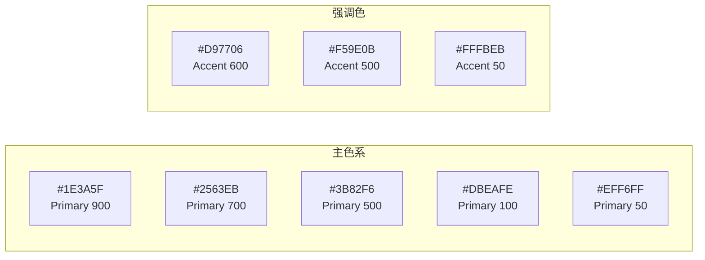
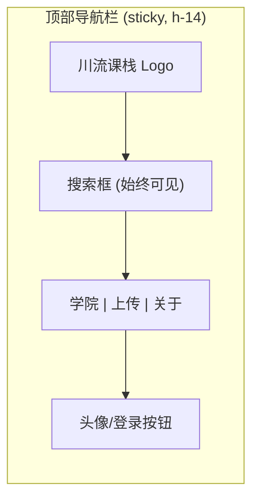
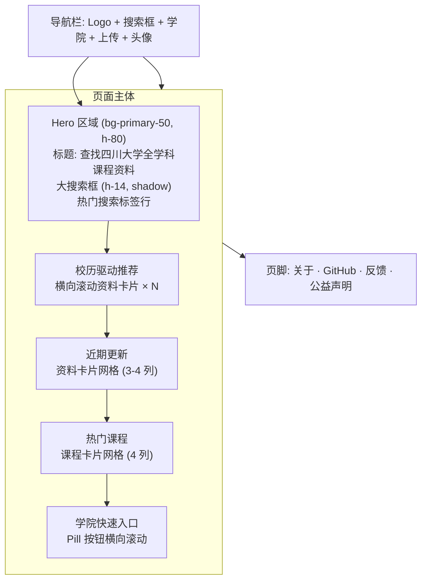
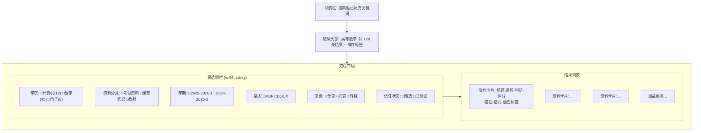
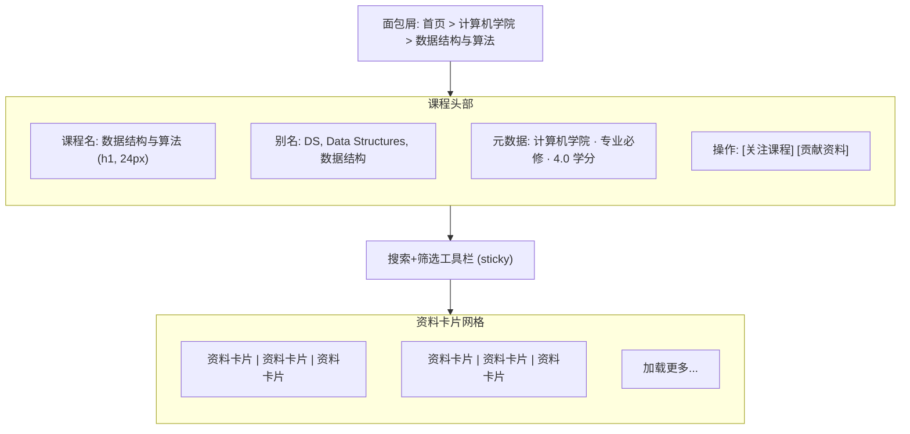
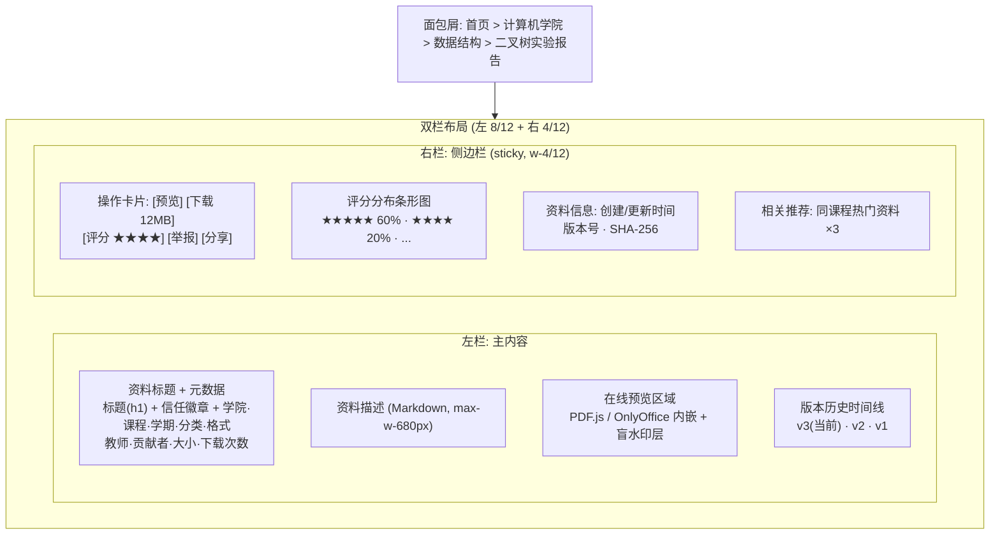
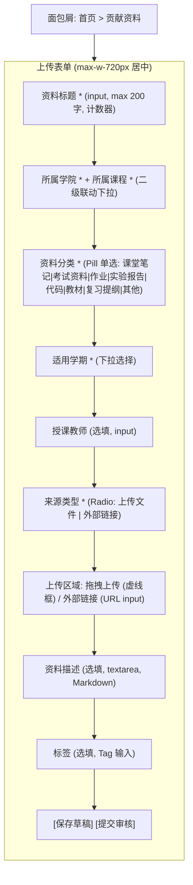
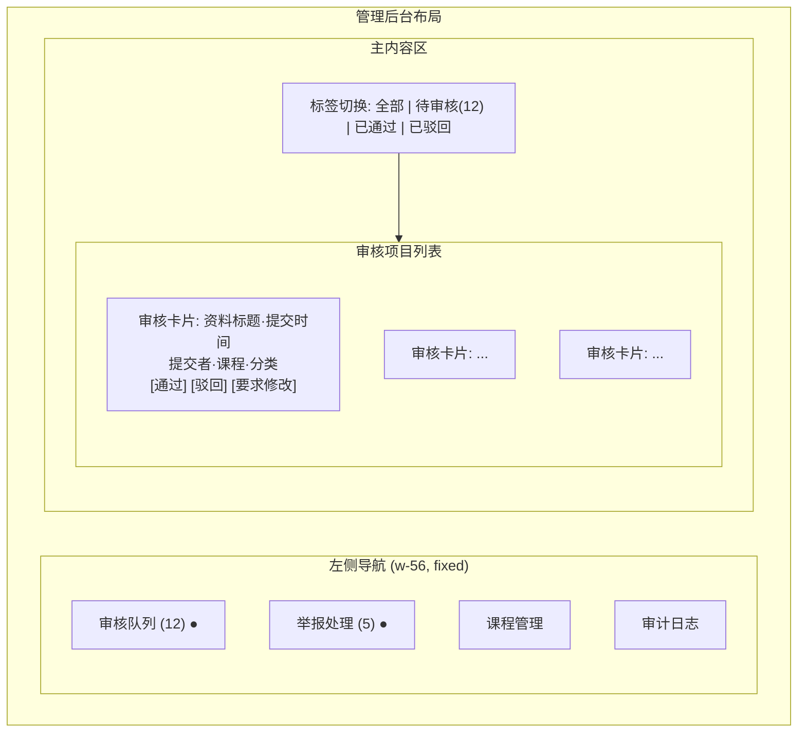
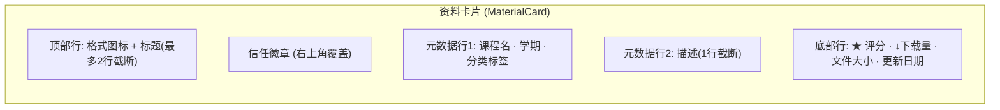

# 川流课栈 UI/UX 设计书

## 目录

1. [设计理念](#1-设计理念)
2. [设计系统](#2-设计系统)
3. [信息架构](#3-信息架构)
4. [页面设计](#4-页面设计)
5. [组件库](#5-组件库)
6. [响应式策略](#6-响应式策略)
7. [交互模式](#7-交互模式)
8. [状态与反馈](#8-状态与反馈)
9. [动效设计](#9-动效设计)
10. [无障碍设计](#10-无障碍设计)
11. [设计交付物](#11-设计交付物)

---

## 1. 设计理念

### 1.1 产品定位

川流课栈是面向四川大学全学科的公益型课程资料共享平台。设计需要传达三个核心品牌属性：

- **可信赖**：资料经过审核与验证，用户能快速判断内容质量
- **高效**：高信息密度，最小化操作步数，搜索即核心
- **公益**：干净、无广告、无商业排名，学院气质而非商业气质

### 1.2 设计原则

| 原则 | 说明 | 落地方式 |
|---|---|---|
| **搜索即入口** | 搜索框是用户最核心的交互入口 | 首页和课程页均以搜索框为视觉重心 |
| **信息密度优先** | 一屏展示更多有效信息，减少滚动层级 | 资料卡片同时展示标题、课程、学期、分类、格式、评分、大小、信任状态 |
| **信任可视** | 信任状态必须一眼可见 | 信任标签使用颜色+图标双重编码，不依赖单一颜色 |
| **低门槛** | 首次访问无需登录即可浏览和搜索 | 所有浏览功能无需登录；仅在下载/上传/评分时要求登录 |
| **一致性** | 同类元素在全局表现一致 | 所有卡片、列表、筛选器、按钮使用统一的设计 token |
| **渐进呈现** | 先展示核心信息，详情按需展开 | 资料列表展示核心元数据，点击进入详情页查看完整信息和预览 |

### 1.3 设计风格

**Swiss Modernism 2.0 + Flat Design 融合**

- 严格的 12 列网格系统，数学比例间距
- 扁平化，无渐变、无投影堆叠（仅保留必要的层级阴影）
- 少量高饱和强调色，克制使用
- 中文字体驱动排版，字号层级清晰
- 无装饰性元素，图标替代装饰
- 高对比度，白底为主，暗色模式暂不作为首版

风格参考：Notion（信息密度）、GitHub（结构化列表）、Wikipedia（内容优先）

---

## 2. 设计系统

### 2.1 色彩体系

以学术蓝为主色调，传达信任与知识感；以暖琥珀色为强调色，用于 CTA 和信任标记。



| Token | 色值 | 用途 |
|---|---|---|
| `--color-primary-900` | `#1E3A5F` | 导航栏背景、页脚背景 |
| `--color-primary-700` | `#2563EB` | 主按钮、链接、选中态 |
| `--color-primary-500` | `#3B82F6` | 常规交互元素、标签 |
| `--color-primary-100` | `#DBEAFE` | 选中行背景、信息提示背景 |
| `--color-primary-50` | `#EFF6FF` | 页面级信息区域背景 |
| `--color-accent-600` | `#D97706` | 重要 CTA 按钮 hover |
| `--color-accent-500` | `#F59E0B` | CTA 按钮、信任徽章（维护者精选）、置顶标记 |
| `--color-accent-50` | `#FFFBEB` | 置顶资料行背景、高亮提示背景 |
| `--color-bg` | `#F8FAFC` | 全局页面背景 |
| `--color-surface` | `#FFFFFF` | 卡片、表格行、面板背景 |
| `--color-text` | `#0F172A` | 正文、标题 |
| `--color-text-secondary` | `#475569` | 次要信息、描述文字、元数据标签 |
| `--color-text-muted` | `#94A3B8` | 占位符、禁用态文字、水印文字 |
| `--color-border` | `#E2E8F0` | 卡片边框、分割线、输入框边框 |
| `--color-border-light` | `#F1F5F9` | 表格内部分割线 |

**语义色**：

| Token | 色值 | 用途 |
|---|---|---|
| `--color-success` | `#059669` | 审核通过、上传成功、信任验证通过 |
| `--color-success-bg` | `#ECFDF5` | 成功状态背景 |
| `--color-warning` | `#D97706` | 存疑标记、待审核 |
| `--color-warning-bg` | `#FFFBEB` | 警告状态背景 |
| `--color-error` | `#DC2626` | 审核驳回、上传失败、举报确认 |
| `--color-error-bg` | `#FEF2F2` | 错误状态背景 |
| `--color-rating` | `#F59E0B` | 星级评分 |

**信任状态专用色**：

| 状态 | 色值 | 图标 |
|---|---|---|
| 维护者精选 | `#D97706` (amber-600) | `ShieldCheck` |
| 社区验证 | `#059669` (emerald-600) | `Users` |
| 未验证 | `#94A3B8` (slate-400) | `Circle` |
| 存疑 | `#DC2626` (red-600) | `AlertTriangle` |

### 2.2 字体系统

**主字体：Noto Sans SC**（思源黑体简体）

```css
@import url('https://fonts.googleapis.com/css2?family=Noto+Sans+SC:wght@300;400;500;600;700&display=swap');

/* Tailwind Config */
fontFamily: {
  sans: ['Noto Sans SC', 'system-ui', '-apple-system', 'sans-serif'],
  mono: ['JetBrains Mono', 'Consolas', 'monospace'],
}
```

Noto Sans SC 是 Google 与 Adobe 联合开发的开源中文字体，覆盖全 CJK 字符集，字形现代清晰，是中文 Web 平台的首选。在 Nuxt 项目中仅加载 `300/400/500/600/700` 五个字重以控制体积（约 2-4MB 子集化后 ~300KB）。

**代码字体：JetBrains Mono**，用于资料中的代码预览和 Markdown 代码块。

**字号层级**：

| Token | 字号 | 行高 | 字重 | 用途 |
|---|---|---|---|---|
| `text-display` | 32px / 2rem | 1.25 | 700 | 首页 Hero 标题 |
| `text-h1` | 24px / 1.5rem | 1.35 | 600 | 页面标题 |
| `text-h2` | 20px / 1.25rem | 1.4 | 600 | 区块标题、课程名称 |
| `text-h3` | 16px / 1rem | 1.5 | 600 | 资料标题、卡片标题 |
| `text-body` | 15px / 0.9375rem | 1.6 | 400 | 正文、资料描述 |
| `text-body-sm` | 14px / 0.875rem | 1.5 | 400 | 元数据标签、次要信息、表格内容 |
| `text-caption` | 13px / 0.8125rem | 1.4 | 400 | 时间戳、计数、辅助信息 |
| `text-caption-sm` | 12px / 0.75rem | 1.3 | 400 | 文件大小、版本号、水印信息 |
| `text-code` | 14px / 0.875rem | 1.6 | 400 | 代码块、Markdown 编辑区 |

**字体使用规则**：
- 同一视图中不超过 4 个字号层级
- 正文行宽控制在 65-75 字符（约 600-680px 最大宽度）
- 中英文混排时，数字和英文使用 Noto Sans SC 自带字形，保持视觉统一

### 2.3 间距系统

基于 4px 基础单位，所有间距为 4 的倍数：

| Token | 值 | 用途 |
|---|---|---|
| `space-1` | 4px | 紧密关联元素间距（图标与文字） |
| `space-2` | 8px | 同一组件内微间距（标签之间） |
| `space-3` | 12px | 组件内间距（卡片的 padding） |
| `space-4` | 16px | 组件间间距（卡片之间） |
| `space-5` | 20px | 区块内间距 |
| `space-6` | 24px | 区块间间距（页面 section 间距） |
| `space-8` | 32px | 大区块间距 |
| `space-10` | 40px | 页面级间距 |
| `space-12` | 48px | Hero 区域间距 |

Tailwind 映射：`p-1`=4px, `p-2`=8px, `p-3`=12px, `p-4`=16px, `p-6`=24px, `p-8`=32px

### 2.4 圆角与阴影

**圆角**：

| Token | 值 | 用途 |
|---|---|---|
| `rounded-sm` | 4px | 标签、徽章、小按钮 |
| `rounded` | 6px | 卡片、面板、输入框、选择器 |
| `rounded-lg` | 10px | 大卡片、模态框、抽屉面板 |
| `rounded-full` | 9999px | 头像、圆形按钮、Pill 标签 |

**阴影**（克制使用，仅用于层级表达）：

| Token | 值 | 用途 |
|---|---|---|
| `shadow-none` | — | 默认，绝大多数元素无阴影 |
| `shadow-sm` | 0 1px 2px rgba(0,0,0,0.05) | 悬停卡片微抬升 |
| `shadow` | 0 1px 3px rgba(0,0,0,0.08), 0 1px 2px rgba(0,0,0,0.06) | 下拉菜单、弹出面板 |
| `shadow-lg` | 0 10px 15px rgba(0,0,0,0.08), 0 4px 6px rgba(0,0,0,0.05) | 模态框 |

### 2.5 图标系统

使用 **Lucide Icons**（开源，MIT 协议），配合 Vue 组件封装。

```vue
<!-- 统一图标组件接口 -->
<AppIcon name="search" size="20" />
<AppIcon name="file-text" size="16" class="text-slate-400" />
```

图标使用规则：
- 统一使用 24×24 viewBox，通过 `size` prop 控制渲染尺寸
- 交互元素上的图标至少 20px（满足 44px 触摸目标的最小图标尺寸）
- 纯装饰性图标使用 `text-slate-400`，功能性图标使用 `text-primary-500`
- 严禁使用 emoji 作为图标

### 2.6 网格系统

基于 12 列网格，内容区最大宽度 `max-w-7xl`（1280px），页面对齐：内容区居中，左右自适应 padding（`px-4 sm:px-6 lg:px-8`）。

| 断点 | 容器宽度 | 自适应边距 | 可用列 |
|---|---|---|---|
| `< 640px` | 100% | 16px | 4 列（简化） |
| `640-1024px` | 100% | 24px | 8 列（简化） |
| `> 1024px` | 1280px max | 自动居中 | 12 列 |

---

## 3. 信息架构

### 3.1 导航结构

```
首页 (/)
├── 全局搜索 → 搜索结果页 (/search?q=...)
├── 学院浏览 → 课程列表 (/courses?college=...)
├── 课程详情 (/course/:id)
│   ├── 资料列表（可筛选、排序）
│   ├── 资料详情 (/material/:id)
│   │   ├── 在线预览
│   │   ├── 版本历史
│   │   └── 下载 (302 → OSS)
│   └── 课程关注
├── 上传资料 (/upload)
├── 个人中心 (/user/profile)
│   ├── 我的贡献
│   ├── 我的收藏/关注
│   └── 最近浏览
└── 管理后台 (/admin/*)
    ├── 审核队列
    ├── 举报处理
    ├── 课程管理
    └── 审计日志
```

### 3.2 全局导航栏



导航栏设计要点：
- `position: sticky; top: 0;` 始终可见
- 高度 56px (`h-14`)，背景 `bg-white/95 backdrop-blur` 半透明毛玻璃
- 底部 1px 边框 `border-slate-200`
- 搜索框居中，占据导航栏约 40% 宽度（桌面端，最小 320px）
- 移动端：Logo + 汉堡菜单，搜索框折叠为图标按钮，点击展开全宽搜索

### 3.3 面包屑

课程页和资料详情页显示面包屑导航：

```
首页 > 计算机学院 > 数据结构与算法 > 考试资料
首页 > 资料详情 > 高等数学第七版课后习题答案
```

面包屑使用 `text-caption` 字号，当前页用 `text-slate-900`，上级页面用 `text-primary-500` 带链接。分隔符使用 `/` 或 `>` 符号。

---

## 4. 页面设计

### 4.1 首页 (`/`)

**渲染模式**：ISR (5min)

**页面结构**（Marketplace/Directory 模式 + 搜索核心 Hero）：



**Hero 区域详细规格**：

- 背景：`bg-primary-50` 渐变至 `bg-white`，高度约 320px（桌面端）
- 标题：`text-display`（32px, 700 字重），`text-primary-900`
- 副标题：`text-body`，`text-slate-500`，显示平台统计数据（动态获取）
- 搜索框：`h-14`（56px），`rounded-lg`，`bg-white` + `shadow`，内嵌放大镜图标 + placeholder 文字
- 热门搜索：`text-caption-sm` 标签，`bg-white rounded-full px-3 py-1 border border-slate-200 hover:border-primary-300`
- 移动端：Hero 高度自适应（~240px），搜索框 `h-12`，热门搜索换行

**校历驱动推荐区块**：

- 区块标题左侧带日历图标 + 当前校历阶段标签（如"期末考试季"徽章，`bg-accent-50 text-accent-600`）
- 资料卡片横向滚动（桌面端 4 列栅格，平板 2 列，移动端单列横向滑动）
- 卡片包含：标题、课程名、学期、评分、格式图标、信任标签
- 右侧"查看更多"链接

**近期更新区块**：

- 时间线风格纵向列表 + 卡片网格混合
- 每行左侧显示相对时间（"2 小时前""昨天""3 天前"），右侧资料卡片
- 桌面端 3 列，平板 2 列，移动端 1 列
- 支持"加载更多"分页（cursor-based）

**热门课程区块**：

- 课程卡片网格：学院名、课程名、资料数量、最新资料时间
- 桌面端 4 列，平板 3 列，移动端 2 列
- 卡片悬停微抬升（`shadow-sm` 过渡）

**学院快速入口**：

- 横向滚动的 Pill 按钮组
- 每个 Pill：学院名，`bg-white border border-slate-200 rounded-full`，点击即跳转
- 支持"全部学院"展开下拉

### 4.2 搜索结果页 (`/search`)

**渲染模式**：SSR



**搜索体验细节**：

- 搜索框支持**实时自动补全**（debounce 300ms），下拉展示匹配的课程名、资料标题（最多 8 条）
- 自动补全结果分类显示："课程"（左侧课程图标）/ "资料"（左侧文件图标），点击直接跳转
- 搜索结果以**资料卡片**形式展示，每张卡片包含：
  - 标题（`text-h3`, 可点击进入详情）
  - 所属课程（链接到课程页）
  - 学期 + 分类 + 格式 标签行
  - 描述（最多 2 行截断，`text-body-sm text-slate-500`）
  - 底部行：评分星级 + 下载次数 + 文件大小 + 信任状态徽章 + 更新时间
- 搜索结果关键词高亮（`<mark>` 标签，`bg-amber-100 text-amber-900`）
- 空结果状态：显示"未找到相关资料"插画 + 建议修改关键词/浏览学院目录/提交资料请求
- 移动端：筛选侧栏折叠为底部抽屉（Bottom Sheet），通过"筛选"按钮呼出

**排序切换**：

- 标签式切换（非下拉）：`[相关度] [最新] [最多下载] [最高评分]`
- 当前激活标签 `bg-primary-50 text-primary-700 font-medium`
- 搜索结果即时刷新（保留筛选条件，仅切换排序参数）

**筛选侧栏规格**：

- 桌面端：固定左侧 `w-56`（224px），`position: sticky; top: 72px`（导航栏高度 + 偏移）
- 每个筛选项显示匹配结果计数（`text-caption-sm text-slate-400`）
- 筛选器即时生效（选中/取消选中即时刷新结果），无需点击"应用"按钮
- 已激活的筛选条件以标签形式显示在结果列表顶部，可单独移除（`×` 按钮）

### 4.3 课程详情页 (`/course/:id`)

**渲染模式**：SSR



**课程头部**：

- 课程名：`text-h1`（24px, 600 字重）
- 别名列表：`text-caption` 灰色 Pill 标签，展示已知别名/简称
- 元数据行：学院 · 课程类别 · 学分
- 操作按钮：`[关注课程]`（outline 按钮 + 铃铛图标，已关注则为实心）、`[贡献资料]`（primary 按钮 + 上传图标）

**课程内搜索与筛选**：

- 课程内搜索框：轻量版，`h-10`，仅搜索当前课程下的资料
- 筛选下拉：分类、学期、格式、来源、信任状态 —— 多选下拉（dropdown checkbox）
- 排序：与搜索结果页一致的标签式切换
- 所有筛选器固定在列表上方，`position: sticky; top: 56px`（导航栏高度）

**资料列表**：

- 桌面端 3 列栅格，平板 2 列，移动端 1 列
- 置顶资料（`is_pinned=true`）显示在最前，卡片带 `bg-accent-50` 背景 + "置顶"标签
- 每张资料卡片可 hover 显示快捷操作：预览、下载（仅图标按钮）

### 4.4 资料详情页 (`/material/:id`)

**渲染模式**：SSR



**左栏主内容区**（占 8/12 列）：

- 标题：`text-h1`（24px, 600 字重）
- 信任状态徽章：紧邻标题右侧，彩色图标 + 文字标签
- 元数据行：使用 `text-body-sm text-slate-500`，各字段以 `·` 分隔
- 描述区域：`text-body`，最大宽度 680px，支持 Markdown 渲染
- 预览区域：带边框的容器，内部加载 PDF.js 或 OnlyOffice 预览，底部叠加半透明水印层（`opacity: 0.06`）
- 版本历史：时间线组件，每个版本显示版本号、日期、更新说明、贡献者、文件大小。当前推荐版本高亮（左侧蓝色圆点 + 加粗标题）

**右栏侧边栏**（占 4/12 列，`position: sticky; top: 72px`）：

- 操作卡片：主按钮 `[预览]`（outline）、`[下载]`（primary，显示文件大小）、星级评分交互组件（可点击打分）
- 评分分布：横向条形图（CSS 实现），显示 1-5 星评分的百分比分布
- 资料信息：结构化元数据列表，每行 label + value
- 相关推荐：同课程下的其他热门资料（最多 3 条）

**移动端布局**：

- 右栏内容移至左栏下方（单列布局）
- 操作按钮固定在底部（Bottom Action Bar）：`[预览] [下载] [评分]`
- 元数据折叠为可展开面板

### 4.5 上传页面 (`/upload`)

**渲染模式**：CSR（需登录）



**表单交互设计**：

- **分布引导**：表单分为若干逻辑区块，每个区块有清晰的标题和说明文字（`text-caption text-slate-400`）
- **实时校验**：字段失去焦点时即时验证（on blur），错误信息以红色小字显示在字段下方
- **学院-课程二级联动**：选择学院后，课程下拉框异步加载该学院下的课程列表（带搜索功能）
- **拖拽上传区域**：虚线边框区域（`border-2 border-dashed border-slate-300`），拖入文件时边框变为主色 + 背景变化。显示已选文件名、大小、格式图标
- **外部链接输入**：URL 输入框自动校验格式，尝试获取链接标题作为资料标题建议
- **资料分类**：Pill 式选择器，单选，选中为 `bg-primary-50 border-primary-500 text-primary-700`
- **学期下拉自动生成**：学期下拉选项从前端自动生成，无需后端接口或数据库存储。规则：以当前月份为基准，向前推算 6 个学期（约 3 年覆盖范围）。每学期格式为 `YYYY-YYYY-X`（示例：九月为开学月，所在学期为 `2026-2027-1`）。生成逻辑：若 `month >= 9`（秋季学期），上学期 = `{year}-{year+1}-1`，上学期之前依次为 `{year-1}-{year}-2`、`{year-1}-{year}-1`...；若 `month < 9`（春季学期），上学期 = `{year-1}-{year}-2`，依次回溯。共生成 6 个选项，当前学期默认选中
- **草稿保存**：自动保存至 localStorage（每 30 秒），防止意外关闭丢失数据
- **提交反馈**：提交后显示 loading spinner → 成功 toast "资料已提交审核" + 跳转至我的贡献页面

### 4.6 管理后台 (`/admin/*`)

**渲染模式**：CSR（需维护者角色）



**审核队列设计要点**：

- 左侧导航栏 `w-56`，`position: fixed`，带未处理数量徽章（红色圆点 + 数字）
- 审核项目卡片包含：资料标题 + 信任状态、提交时间、提交者匿名标识、所属课程、资料分类、文件信息
- 每个卡片上有三个操作按钮：`[通过]`（success 绿）、`[驳回]`（error 红）、`[要求修改]`（warning 黄）
- 点击任一操作按钮弹出确认对话框（填写审核意见，选填）
- 支持批量操作：勾选多个审核项 → 顶部出现操作栏 `已选择 3 项 [批量通过] [批量驳回]`
- 审核完成后卡片滑出（带过渡动画），队列计数实时更新

---

## 5. 组件库

### 5.1 资料卡片 (MaterialCard)

平台最核心的重复组件，需承载高密度信息。



**规格**：

| 属性 | 桌面端 | 移动端 |
|---|---|---|
| 宽度 | 自适应栅格 (1/3 或 1/4) | 100% |
| 最小高度 | 160px | 140px |
| Padding | 16px | 14px |
| 边框 | `border border-slate-200 rounded-lg` | 同 |
| 悬停态 | `shadow-sm` + `border-slate-300` | 无 hover |
| 标题字号 | `text-h3` (16px) | 15px |
| 标题行数 | 最多 2 行，`line-clamp-2` | 同 |

**信任徽章位置**：卡片右上角，绝对定位，`top-3 right-3`。

**置顶样式**：`bg-accent-50 border-amber-200`，标题左侧显示 📌 置顶图标（16px）。

### 5.2 搜索框 (SearchBar)

**两种尺寸**：

| 场景 | 高度 | 圆角 | 阴影 | 图标 |
|---|---|---|---|---|
| Hero 大搜索框 | 56px (h-14) | 10px (rounded-lg) | shadow | 放大镜 24px |
| 导航栏搜索框 | 40px (h-10) | 8px (rounded) | 无 | 放大镜 18px |
| 课程内搜索 | 40px (h-10) | 8px (rounded) | 无 | 放大镜 18px |

**交互状态**：

- Default：`bg-white border border-slate-200`
- Focus：`border-primary-500 ring-2 ring-primary-100`（4px 蓝色外发光环）
- Loading：搜索框内右侧显示小型 spinner（16px）
- 带值：右侧显示清除按钮（× 图标）

**自动补全下拉**：

- 绝对定位，`top: 100% + 4px`，`bg-white rounded-lg shadow border`
- 最大高度 320px，溢出滚动
- 分类显示："课程"（左侧书图标）/ "资料"（左侧文件图标）
- Hover 项 `bg-primary-50`，键盘 ↑↓ 可导航
- 底部"查看全部结果"链接

### 5.3 信任徽章 (TrustBadge)

| 状态 | 图标 | 颜色 | 文字 |
|---|---|---|---|
| `maintainer_picked` | `ShieldCheck` (16px) | `text-amber-600 bg-amber-50` | 维护者精选 |
| `community_verified` | `Users` (16px) | `text-emerald-600 bg-emerald-50` | 社区验证 |
| `unverified` | `Circle` (16px) | `text-slate-400 bg-slate-100` | 未验证 |
| `doubtful` | `AlertTriangle` (16px) | `text-red-600 bg-red-50` | 存疑 |

规格：Pill 形状，`rounded-full px-2.5 py-0.5`，`text-caption-sm font-medium`，图标 + 文字水平排列，间距 4px。

### 5.4 评分组件 (RatingWidget)

- 5 颗星，SVG 图标，每颗 20px
- 未选中：`text-slate-200`（空心星）
- 已选中：`text-amber-400`（实心星）
- 显示模式：只读星星 + 数值（如 `★ 4.2`）
- 交互模式：hover 时星星逐颗高亮，click 确认评分，提交后 toast "评分已提交"
- 半星支持（使用 clip-path 或渐变 mask）

### 5.5 筛选面板 (FilterPanel)

**桌面端**：侧边栏固定面板

- 每个筛选项组有标题（`text-caption font-medium text-slate-500 uppercase`）+ 间距
- 复选框列表，每行 40px 高（满足 44px 触摸目标）
- 已选项右侧显示 ✓ 图标 + `text-primary-700 font-medium`
- 选中计数显示在组标题右侧（`text-caption-sm text-slate-400`）

**移动端**：底部抽屉 (Bottom Sheet)

- 从屏幕底部滑入，最大高度 70vh
- 顶部拖动条（drag handle）+ "筛选"标题 + "清除全部"按钮
- 底部固定"应用筛选"按钮（`h-12, w-full, rounded-lg`）
- 遮罩层半透明黑色 `bg-black/40`，点击遮罩关闭

### 5.6 文件上传区域 (DropZone)

**Default 状态**：`border-2 border-dashed border-slate-300 rounded-lg bg-slate-50`，居中显示上传图标 + "拖拽文件到此处，或点击上传"。

**Drag Over 状态**：`border-primary-500 bg-primary-50`，图标变为主色。

**已选文件状态**：虚线边框变为实线，显示文件信息行（格式图标 + 文件名 + 大小 + 移除按钮）。

**上传进度**：文件信息行下方显示进度条（`h-1 bg-primary-500 rounded-full transition-width`）+ 百分比。

**格式限制提示**：底部 `text-caption-sm text-slate-400` 列出支持的文件格式和大小限制。

### 5.7 版本时间线 (VersionTimeline)

- 垂直时间线，左侧蓝色竖线 + 圆点
- 当前推荐版本：蓝色实心圆点（`bg-primary-500`，`w-3 h-3`）+ 加粗标题
- 历史版本：灰色空心圆点（`border-2 border-slate-300`）+ 常规标题
- 每项内容：版本号 · 日期 · 贡献者 · 文件大小 · 更新说明（如有）
- 文本类资料支持"查看差异"按钮（仅在 v1 以上显示），点击跳转 diff 视图

---

## 6. 响应式策略

### 6.1 断点定义

| 断点 | 最小宽度 | 设计宽度 | 列数 |
|---|---|---|---|
| `xs` (手机) | 375px | 375px | 1 列 |
| `sm` (大屏手机) | 640px | 640px | 1-2 列 |
| `md` (平板竖屏) | 768px | 768px | 2 列 |
| `lg` (平板横屏/小屏笔记本) | 1024px | 1024px | 2-3 列 |
| `xl` (桌面) | 1280px | 1280px | 3-4 列 |

### 6.2 各断点布局变化

| 页面 | xs (< 640px) | sm-md (640-1024px) | lg+ (> 1024px) |
|---|---|---|---|
| 首页 Hero | 搜索框全宽，热门搜索换行 | Hero 高度 280px | 搜索框 640px 居中，Hero 320px |
| 首页资料卡片 | 1 列纵向滚动 | 2 列栅格 | 3-4 列栅格 |
| 搜索结果 | 筛选器折叠为底部抽屉 | 筛选器折叠 | 左侧筛选面板 (224px) + 结果列表 |
| 课程页资料列表 | 1 列 | 2 列 | 3 列 |
| 资料详情 | 单列，底部固定操作栏 | 右栏移至底部 | 左 8/12 + 右 4/12 |
| 上传表单 | 全宽输入框 | 字段 2 列排列 | 表单最大宽度 720px 居中 |
| 管理后台 | 左侧导航隐藏 (顶部 tab 切换) | 左侧导航折叠为图标 | 左侧导航展开 224px |
| 导航栏 | Logo + 汉堡菜单 + 搜索图标 | 搜索框缩小 | 完整导航栏 |

### 6.3 移动端专项优化

- 表格类内容转为卡片列表（如资料列表、搜索结果、审核队列）
- 多列筛选面板转为 Bottom Sheet
- 面包屑在 640px 以下隐藏（仅显示返回箭头 + 当前页标题）
- 底部固定操作栏（Bottom Action Bar）用于高频操作（下载、预览、评分）
- 下拉刷新支持（首页信息流）
- 横向滑动支持（学院 Pill 导航、热门搜索标签）
- 触摸目标最小 44×44px，按钮高度最小 40px

---

## 7. 交互模式

### 7.1 搜索交互

```
用户输入 → debounce 300ms → 自动补全请求
  ├── 无输入 → 隐藏补全面板
  ├── 有结果 → 显示补全列表 (最多 8 条)，分类 "课程" / "资料"
  ├── 点击补全项 → 直接跳转到课程页或资料详情页
  └── 回车 / 点击搜索 → 跳转搜索结果页 (/search?q=...)
```

- 搜索结果页保留搜索词在 URL query string 中（支持分享和浏览器前进/后退）
- 自动补全使用 `AbortController` 取消上一次未完成的请求
- 搜索无结果时，提供"浏览学院目录"和"提交资料请求"两个出口

### 7.2 上传交互

```
选择文件 → 前端 SHA-256 预计算 → 发送哈希查重
  ├── 已存在 → Toast "该文件已存在，点击查看" → 不重复上传
  └── 不存在 → 获取 Presigned URL → 直接上传至 OSS
       ├── 进度回调 → 更新进度条 UI
       ├── 成功 → POST /api/materials 创建资料记录
       │      → Toast "资料已提交审核" → 跳转我的贡献
       ├── 失败 → 显示错误信息 + 重试按钮
       └── 网络中断 → 自动恢复（断点续传预留）
```

- 大文件上传使用分片上传（预留，首版可先走直传）
- 上传进度条显示百分比 + 已上传/总大小
- 上传中允许用户继续填写其他表单字段（异步上传）

### 7.3 评分交互

```
点击星级 → 弹出评分确认 (可选评论)
  ├── 乐观更新：UI 立即显示用户评分
  ├── API 调用：POST /api/materials/:id/ratings
  │   ├── 成功 → 静默，无额外反馈
  │   └── 失败 → 回滚评分 + Toast "评分失败，请重试"
  └── 每人每资料仅可评分一次（再次点击可修改评分）
```

### 7.4 关注/收藏交互

- 点击关注按钮：乐观切换 UI 状态（空心铃铛 ↔ 实心铃铛）
- 无需确认对话框，即时生效
- 关注后自动出现在首页"关注课程更新"区域

### 7.5 无限滚动与分页

- 首页信息流、课程资料列表：**无限滚动**（Intersection Observer + cursor-based pagination）
- 搜索结果列表：**传统分页**（页码 + 上一页/下一页），因为搜索结果需支持 URL 分享
- 滚动加载触发器：距底部 200px 时触发加载
- 加载指示器：底部小型 spinner + "加载中..." 文字
- 已加载全部：底部显示 "已展示全部 X 条结果"（`text-caption text-slate-400`）

### 7.6 键盘快捷键

| 快捷键 | 作用 |
|---|---|
| `/` | 聚焦全局搜索框 |
| `Esc` | 关闭模态框/下拉面板/自动补全 |
| `Enter` | 搜索框内 → 提交搜索；表单内 → 提交表单 |
| `↑↓` | 自动补全列表导航 |
| `Tab` / `Shift+Tab` | 焦点在表单字段间移动 |

---

## 8. 状态与反馈

### 8.1 加载状态

**骨架屏 (Skeleton)**：用于首次加载和整页刷新。

- 资料卡片骨架：灰色矩形模拟标题行（2 行，不同宽度）+ 标签行 + 底部元数据行
- 使用 `animate-pulse` 动画（opacity 在 100% 和 40% 之间循环，持续 2s）
- 骨架数量与真实卡片行列数一致

**Spinner**：用于按钮操作、搜索加载、下拉刷新。

- 标准尺寸：20px（按钮内）、24px（区块加载）、32px（全页加载）
- 颜色：`text-primary-500`
- 旋转动画：`animate-spin`（1s 线性无限旋转）

**进度条**：仅用于文件上传场景。

- 高度 4px，`bg-primary-500 rounded-full`
- 平滑过渡：`transition-width duration-300`

### 8.2 空状态

| 场景 | 图标 | 主文案 | 副文案 + 操作 |
|---|---|---|---|
| 搜索无结果 | 放大镜 + 问号 | 未找到相关资料 | "试试修改搜索关键词，或[浏览学院目录]" |
| 课程无资料 | 文件夹打开 | 该课程暂无资料 | "成为第一位贡献者，[上传资料]" |
| 我的贡献为空 | 上传图标 | 你还没有贡献资料 | "[开始贡献]" |
| 审核队列为空 | 勾选图标 | 审核队列已清空 | "所有提交已处理完毕" |
| 我的收藏为空 | 心形图标 | 还没有收藏资料 | "[去发现资料]" |

空状态设计规范：
- 图标在最上方（40-48px，`text-slate-300`）
- 主文案 `text-h3 text-slate-500 font-medium`，间距 12px
- 副文案 `text-body-sm text-slate-400`，操作链接使用 `text-primary-500`
- 整体垂直居中于可用空间，Padding 上下 64px

### 8.3 错误状态

| 场景 | 处理方式 |
|---|---|
| 网络错误 | Toast 通知 "网络连接失败，请检查网络" + 重试按钮 |
| API 错误 (4xx) | 表单字段下方显示具体错误信息 + 全局 Toast |
| API 错误 (5xx) | 全局错误页面（或区块内错误提示） + "稍后重试"按钮 |
| 文件上传失败 | 上传区域显示错误提示 + 重试按钮 |
| 预览加载失败 | 预览区域显示 "文件预览失败" + 文件信息 + 直接下载按钮 |

### 8.4 Toast 通知

使用 Element Plus 的 `ElNotification` 或自建 Toast 组件：

- 位置：右上角（桌面端）、顶部居中（移动端）
- 类型：success (绿)、warning (黄)、error (红)、info (蓝)
- 自动消失：success 3s、info 5s、warning 5s、error 不自动消失（需手动关闭）
- 内容：一行文字 + 可选操作按钮（如"查看"、"重试"）
- 最多同时显示 3 条，超出则排队

---

## 9. 动效设计

### 9.1 动效原则

- 持续时间：150-300ms（微交互，如 hover、focus）、200-500ms（页面级过渡）
- 缓动函数：`ease-out`（进入）、`ease-in`（退出）、`ease-in-out`（状态切换）
- 仅使用 `transform` 和 `opacity` 做动画（GPU 加速），禁止动画 `width`/`height`
- 尊重 `prefers-reduced-motion`：当用户系统设置为减少动效时，所有动画时长降至 0ms

```css
/* 全局动效回退 */
@media (prefers-reduced-motion: reduce) {
  *, *::before, *::after {
    animation-duration: 0.01ms !important;
    transition-duration: 0.01ms !important;
  }
}
```

### 9.2 微交互清单

| 元素 | 触发方式 | 动效 | 时长 | 缓动 |
|---|---|---|---|---|
| 按钮 hover | 鼠标悬停 | `bg` 颜色变深 10% | 150ms | ease-out |
| 卡片 hover | 鼠标悬停 | `translateY(-2px)` + `shadow-sm` | 200ms | ease-out |
| 输入框 focus | 聚焦 | `border-color` + `ring` 外发光 | 200ms | ease-out |
| 下拉菜单 | 点击 | `opacity 0→1` + `translateY(-4px→0)` | 200ms | ease-out |
| 模态框 | 打开 | `opacity 0→1` + `scale(0.95→1)` | 250ms | ease-out |
| 模态框 | 关闭 | `opacity 1→0` + `scale(1→0.95)` | 150ms | ease-in |
| Toast 通知 | 出现 | `translateX(100%→0)` + `opacity 0→1` | 300ms | ease-out |
| Toast 通知 | 消失 | `opacity 1→0` + `translateX(0→100%)` | 200ms | ease-in |
| 骨架屏 | 持续 | `opacity` 脉动 100%↔40% | 2s 循环 | ease-in-out |
| Spinner | 持续 | `rotate(0→360deg)` | 1s 循环 | linear |
| 无限滚动加载 | 滚动触发 | `opacity 0→1` + `translateY(8px→0)` | 300ms | ease-out |
| 审核卡片 | 操作后 | `opacity 1→0` + `max-height 200px→0` | 300ms | ease-in |
| 筛选面板 (移动端) | 呼出 | `translateY(100%→0)` | 300ms | ease-out |
| 自动补全 | 出现 | `opacity 0→1` + `translateY(-4px→0)` | 150ms | ease-out |
| 页面切换 | 路由变化 | `opacity 0→1` (fade) | 200ms | ease-out |

### 9.3 品牌动效（首版暂缓，预留）

以下动效首版不强制实现，但在 CSS 中预留变量以保持一致性：

- Logo 微交互：鼠标悬停 Logo 时，轻微旋转或颜色偏移
- 上传成功：完成图标从 `scale(0)` 弹入（spring 物理动效）
- 评级点击：选中星形有短暂的 `scale(1.2)` 弹跳

---

## 10. 无障碍设计

### 10.1 色彩对比度

所有文本颜色组合需满足 WCAG AA 标准（正常文本 4.5:1，大文本 3:1）：

| 组合 | 前景 | 背景 | 对比度 | 达标 |
|---|---|---|---|---|
| 正文文本 | `#0F172A` | `#FFFFFF` | 15.4:1 | AAA |
| 次要文本 | `#475569` | `#FFFFFF` | 5.5:1 | AA |
| 主按钮文字 | `#FFFFFF` | `#2563EB` | 5.1:1 | AA |
| 链接文字 | `#2563EB` | `#F8FAFC` | 5.2:1 | AA |
| 占位符文字 | `#94A3B8` | `#FFFFFF` | 3.2:1 | **不达标（仅占位符豁免）** |
| 琥珀标签文字 | `#D97706` | `#FFFBEB` | 4.6:1 | AA |

信任状态徽章不能仅依赖颜色区分。每种状态同时使用**颜色 + 图标 + 文字**三重编码，确保色觉障碍用户也能区分。

### 10.2 键盘导航

- Tab 键顺序与视觉布局顺序一致
- 所有交互元素（按钮、链接、输入框、选择器）可通过 Tab 获取焦点
- Focus 指示器使用 `ring-2 ring-primary-500 ring-offset-2`（2px 蓝色环 + 2px 白色间距），确保任何背景下都可见
- 模态框打开时，焦点锁定在模态框内；关闭时焦点返回触发元素
- 下拉菜单内支持 ↑↓ 键导航，Enter 键选择
- 跳过导航链接（Skip Link）：页面顶部隐藏链接，Tab 到可见 → "跳到主内容"

### 10.3 语义 HTML

- 使用正确的 heading 层级（h1 → h2 → h3，不跳级）
- 使用 `<nav>`、`<main>`、`<section>`、`<article>`、`<aside>` 等语义标签
- 所有 `` 提供有意义的 `alt` 属性（资料封面、图标等纯装饰性图片用 `alt=""`）
- 表单输入框使用 `<label for="...">` 关联，不使用仅 placeholder 的输入框
- 表格使用 `<thead>`、`<tbody>`、`<th scope="col/row">`

### 10.4 ARIA 标注

- 图标按钮（无文字）使用 `aria-label` 描述功能（如 `aria-label="下载资料"`）
- 动态内容区域使用 `aria-live="polite"` 或 `aria-live="assertive"` 通知屏幕阅读器
- 模态框使用 `role="dialog"` + `aria-modal="true"` + `aria-labelledby`
- 加载状态使用 `aria-busy="true"`
- Toast 通知使用 `role="status"` + `aria-live="polite"`

### 10.5 触摸目标

- 所有可点击元素最小 44×44px（WCAG 2.5.5）
- 列表项高度最小 48px（资料列表、搜索结果、筛选选项）
- 按钮高度：`h-10` (40px) 用于次要按钮，`h-11` (44px) 用于主要按钮
- 筛选器复选框区域扩大到 44×44px，不仅限于 checkbox 本身

---

## 11. 设计交付物

### 11.1 设计 Token JSON（供开发使用）

```json
{
  "colors": {
    "primary": { "50": "#EFF6FF", "100": "#DBEAFE", "500": "#3B82F6", "700": "#2563EB", "900": "#1E3A5F" },
    "accent": { "50": "#FFFBEB", "500": "#F59E0B", "600": "#D97706" },
    "bg": "#F8FAFC",
    "surface": "#FFFFFF",
    "text": { "primary": "#0F172A", "secondary": "#475569", "muted": "#94A3B8" },
    "border": { "default": "#E2E8F0", "light": "#F1F5F9" },
    "success": "#059669",
    "warning": "#D97706",
    "error": "#DC2626",
    "rating": "#F59E0B"
  },
  "typography": {
    "fontFamily": { "sans": ["Noto Sans SC", "system-ui", "sans-serif"], "mono": ["JetBrains Mono", "monospace"] },
    "fontSize": {
      "display": { "size": "2rem", "lineHeight": "1.25", "weight": "700" },
      "h1": { "size": "1.5rem", "lineHeight": "1.35", "weight": "600" },
      "h2": { "size": "1.25rem", "lineHeight": "1.4", "weight": "600" },
      "h3": { "size": "1rem", "lineHeight": "1.5", "weight": "600" },
      "body": { "size": "0.9375rem", "lineHeight": "1.6", "weight": "400" },
      "bodySm": { "size": "0.875rem", "lineHeight": "1.5", "weight": "400" },
      "caption": { "size": "0.8125rem", "lineHeight": "1.4", "weight": "400" },
      "captionSm": { "size": "0.75rem", "lineHeight": "1.3", "weight": "400" }
    }
  },
  "spacing": {
    "base": "4px",
    "scale": [0, 4, 8, 12, 16, 20, 24, 32, 40, 48]
  },
  "borderRadius": {
    "sm": "4px",
    "default": "6px",
    "lg": "10px",
    "full": "9999px"
  },
  "shadows": {
    "sm": "0 1px 2px rgba(0,0,0,0.05)",
    "default": "0 1px 3px rgba(0,0,0,0.08), 0 1px 2px rgba(0,0,0,0.06)",
    "lg": "0 10px 15px rgba(0,0,0,0.08), 0 4px 6px rgba(0,0,0,0.05)"
  }
}
```

### 11.2 页面清单与状态矩阵

| 页面 | 加载态 | 空状态 | 错误态 | 权限态 |
|---|---|---|---|---|
| 首页 `/` | 骨架屏 (资料卡片×6) | 初始无数据提示 | 区块级错误 + 重试 | 无需登录 |
| 搜索结果 `/search` | 骨架屏 | 无结果 + 建议 | 错误 + 重试 | 无需登录 |
| 课程页 `/course/:id` | 骨架屏 | 无资料 + 上传引导 | 错误 + 重试 | 无需登录 |
| 资料详情 `/material/:id` | 骨架屏 + 预览 loading | 不适用 | 预览失败 + 下载按钮 | 无需登录（预览/下载需登录） |
| 上传页 `/upload` | 表单骨架屏 | 表单初始态 | 提交失败 + 重试 | 需登录 |
| 个人中心 `/user/*` | 骨架屏 | 无贡献/无收藏 | 错误 + 重试 | 需登录 |
| 管理后台 `/admin/*` | 骨架屏 | 审核队列已清空 | 错误 + 重试 | 需维护者角色 |

### 11.3 设计稿标注规范

- 所有间距以设计 Token 名标注（如 `spacing-4` 而非 `16px`）
- 颜色以 CSS 变量名标注（如 `var(--color-primary-700)` 而非 `#2563EB`）
- 字号以 Tailwind class 标注（如 `text-body` 而非 `15px`）
- 组件标注包含：尺寸（宽高）、间距（padding/margin/gap）、字号、字重、颜色、圆角、边框、阴影
- 响应式标注要注明各断点的变化

---

> **文档版本**: v1.0 | **设计参考**: Swiss Modernism 2.0 + Flat Design | **字体**: Noto Sans SC | **技术栈**: Nuxt 3 + Element Plus + Tailwind CSS | **最后更新**: 2026-06-14
